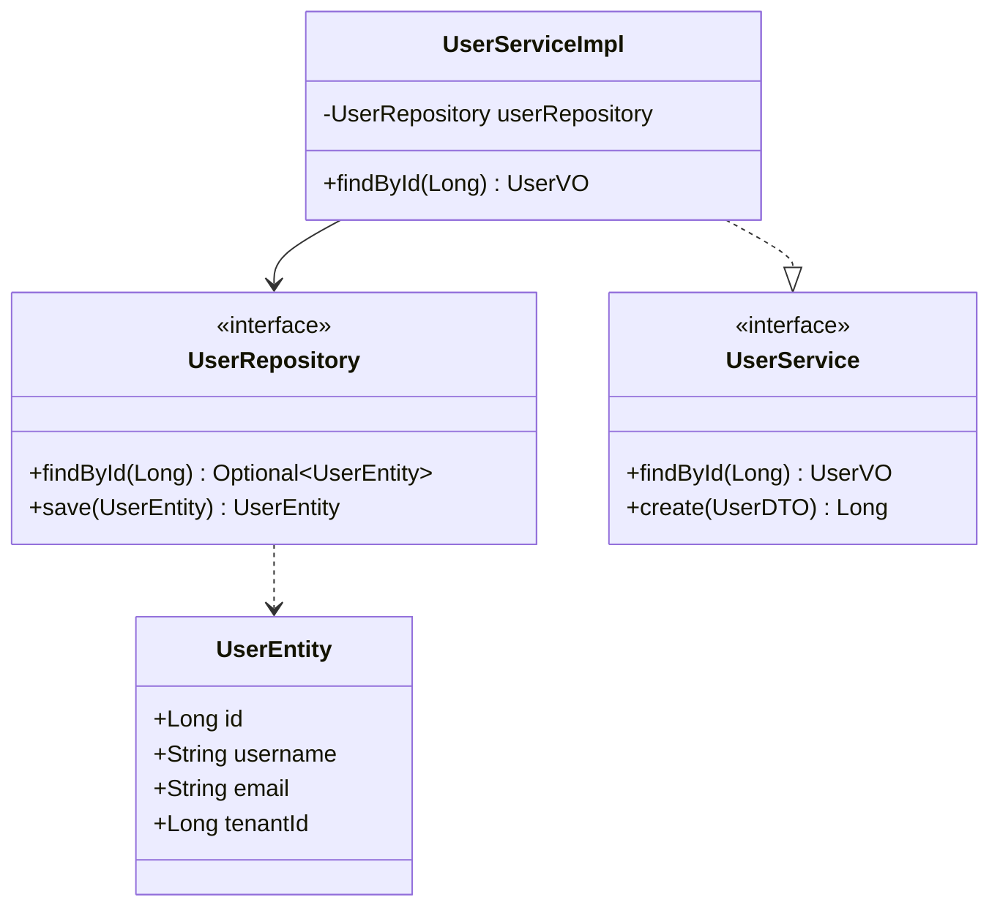
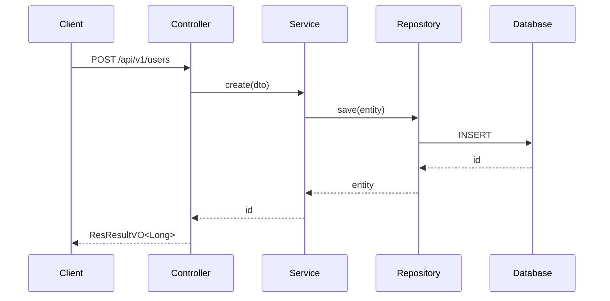

# 详细设计（LLD）

> 功能级详细设计：类图 + 接口 + 数据模型 + 时序图 + 错误处理 + 测试策略。
> 产出 `changes/proposals/<id>/design.md`。

## 前置条件

- 变更提案存在
- 新项目：HLD 已完成
- 历史项目：变更涉及架构/模型/接口变更

## 执行步骤

### 第 1 步：读 HLD（如有）

```bash
cat changes/proposals/<current>/hld.md  # 新项目
cat changes/proposals/<current>/proposal.md
```

### 第 2 步：类图设计

用 mermaid 画类图：



### 第 3 步：接口定义

按 `api-design` 技能输出契约：

```java
// 内部 API
GET  /api/v1/users/{id}           → UserVO
GET  /api/v1/users/page           → ResPage<UserVO>
POST /api/v1/users                → Long
PUT  /api/v1/users/{id}           → void
DELETE /api/v1/users/{id}         → void

// 开放 API
GET  /api/open/v1/users/{id}      → UserVO
```

### 第 4 步：数据模型

按 `model-design` 和 `database-design` 技能输出：

- Entity / PO / DTO / VO / Query 定义
- 数据表 DDL
- Flyway 迁移脚本

### 第 5 步：时序图

画关键业务流程的时序图：



### 第 6 步：错误处理

| 场景 | 错误码 | HTTP 状态 | 处理 |
|---|---|---|---|
| 用户不存在 | USER_001 | 404 | CommonException |
| 用户名重复 | USER_002 | 400 | CommonException |
| 参数校验失败 | COMMON_001 | 400 | CommonException |
| ... | ... | ... | ... |

### 第 7 步：测试策略

- **单测**：Service 层全方法覆盖
- **集成测试**：Controller 层 + 数据库（Testcontainers）
- **E2E 测试**：关键业务流程

### 第 8 步：产出 design.md

写入 `changes/proposals/<id>/design.md`：

```markdown
# 详细设计：<标题>

## 类图
<mermaid>

## 接口定义
<API 契约>

## 数据模型
<Entity / PO / DTO / VO / DDL>

## 时序图
<mermaid>

## 错误处理
<错误码表>

## 测试策略
<单测 / 集成 / E2E 覆盖范围>

## 关键决策
<决策 1 / 决策 2>
```

## 产出物

- `changes/proposals/<id>/design.md`
- 类图 / 接口定义 / 数据模型 / 时序图 / 错误处理 / 测试策略

## 完成标准

- 类图清晰
- 接口契约完整
- 数据模型符合规范
- 错误处理完备
- 测试策略明确

## 下一步

进入 `coding` 开始编码实现。

## 关联

- 前置：`high-level-design`（新项目）或 `requirement-analysis`（历史项目）
- 后续：`coding`
- 支撑：`model-design` / `api-design` / `database-design`
- Wiki：`wiki/_common/detailed-design.md`
