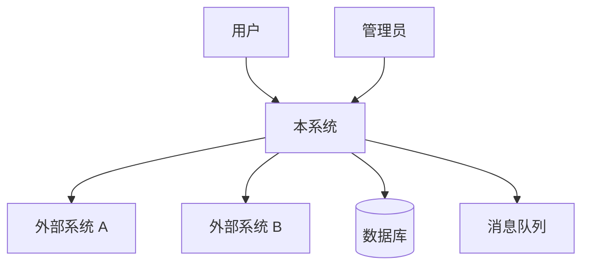
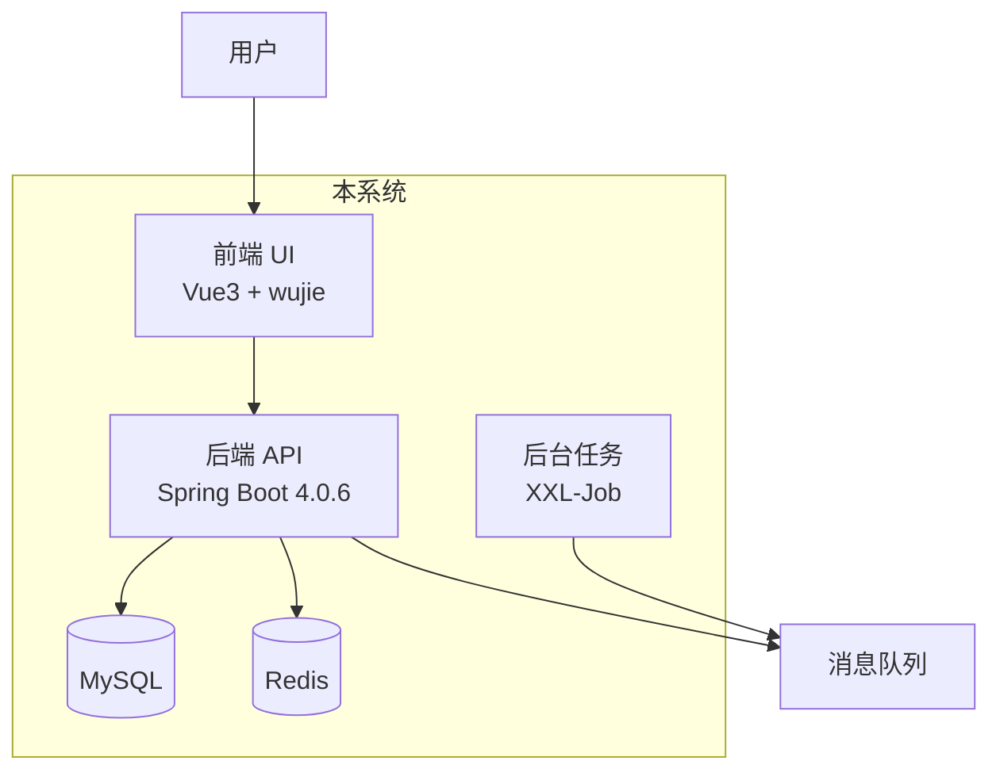

# 概要设计（HLD）

> 用于**新项目**或大版本重构的系统级架构设计。
> 产出 C4 Level 1（系统上下文）+ Level 2（容器）+ 技术选型。

## 前置条件

- 变更提案存在（`changes/proposals/<current>/proposal.md`）
- **新项目**：proposal 类型为"新建项目"
- **大版本重构**：proposal 类型为"架构演进"

## 双流程区分

### 新项目流程（MUST 完整执行）

```
需求 → 概要设计（本技能）→ 详细设计（detailed-design）→ 编码 → ...
```

**MUST 完成 HLD 才能进入 LLD**。

### 历史项目流程（可跳过）

功能更新类变更**通常不需要 HLD**，可直接进入详细设计或编码。
仅当变更涉及**架构调整 / 技术栈升级 / 服务拆分**时才需要 HLD。

## 执行步骤

### 第 1 步：明确系统边界

**MUST 与用户确认**：
- 系统做什么（核心业务价值）
- 系统不做什么（明确非目标）
- 系统的用户是谁（内部 / 外部 / 第三方）
- 系统的上下游（依赖谁 / 被谁依赖）

### 第 2 步：系统上下文图（C4 Level 1）

用 mermaid 画系统上下文图：



### 第 3 步：容器图（C4 Level 2）

把系统拆分为"容器"（可独立部署的单元）：



### 第 4 步：技术选型

**MUST 按 stack-constraints 选择**：

| 维度 | 选型 | 理由 |
|---|---|---|
| 后端框架 | Spring Boot 4.0.6 + JDK 17 | stack-constraints 强制 |
| 持久化 | MyBatis-Plus 3.5.16 | 生态标准 |
| 安全 | structure-security | 生态必选 |
| JSON | FastJSON | 生态必选 |
| 服务间调用 | Spring Cloud OpenFeign | 生态标准 |
| 注册中心 | Nacos | 生态标准 |
| 消息队列 | RocketMQ / Kafka | 按需求 |
| 缓存 | Redis | 生态标准 |
| 数据库 | MySQL 8.0 | 生态标准 |
| 前端 | Vue 3 + wujie | 生态标准 |

**禁止**：
- ❌ 凭 LLM 印象选型（MUST 按 stack-constraints）
- ❌ 选生态外的组件（除非有充分理由 + 用户确认）

### 第 5 步：数据流图

画出关键业务场景的数据流：

```
用户登录：
  用户 → 前端 → API → structure-security（JWT 签发）
                  ↓
                Redis（缓存 token）
                  ↓
                数据库（验证用户）
```

### 第 6 步：风险与缓解

| 风险 | 影响 | 缓解 |
|---|---|---|
| <风险 1> | 高/中/低 | <缓解措施> |
| ... | ... | ... |

### 第 7 步：产出 HLD 文档

写入 `changes/proposals/<id>/hld.md`：

```markdown
# 概要设计：<标题>

## 系统边界
<做什么 / 不做什么 / 上下游>

## 系统上下文图
<mermaid>

## 容器图
<mermaid>

## 技术选型
<表格>

## 数据流
<关键场景的数据流>

## 风险与缓解
<表格>

## 模块划分（高层）
<各模块职责一句话>
```

## 产出物

- `changes/proposals/<id>/hld.md`
- 系统上下文图
- 容器图
- 技术选型清单
- 数据流图

## 完成标准

- 系统边界经用户确认
- 技术选型符合 stack-constraints
- 关键风险已识别
- HLD 文档完整

## 下一步

- **新项目**：进入 `detailed-design`（详细设计）
- **历史项目架构演进**：进入 `module-decomposition`（模块拆分）

## 关联

- 前置：`requirement-analysis`
- 后续：`detailed-design`（新项目）/ `module-decomposition`（拆分场景）
- Wiki：`wiki/_common/architecture.md` `wiki/_common/high-level-design.md`
