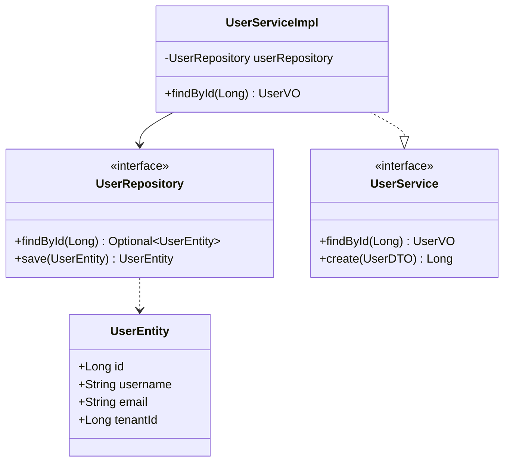
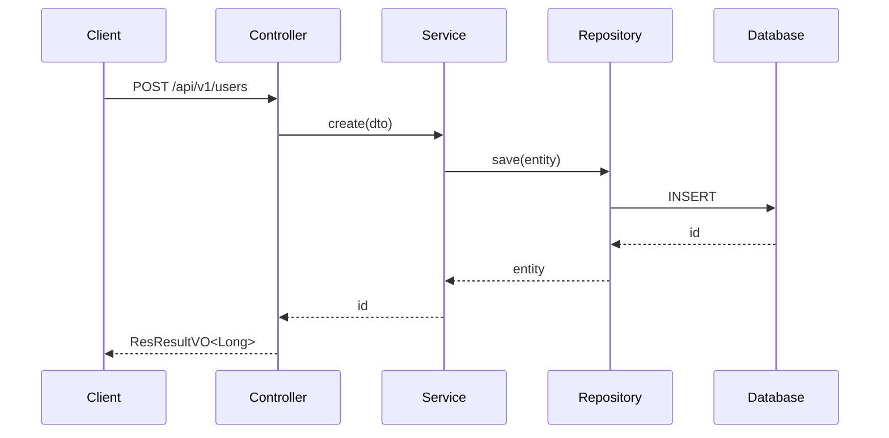
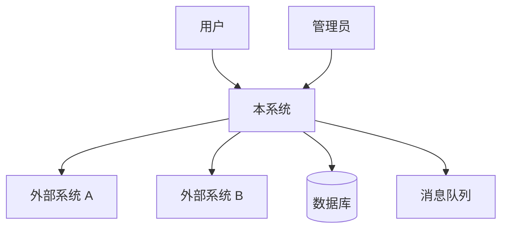
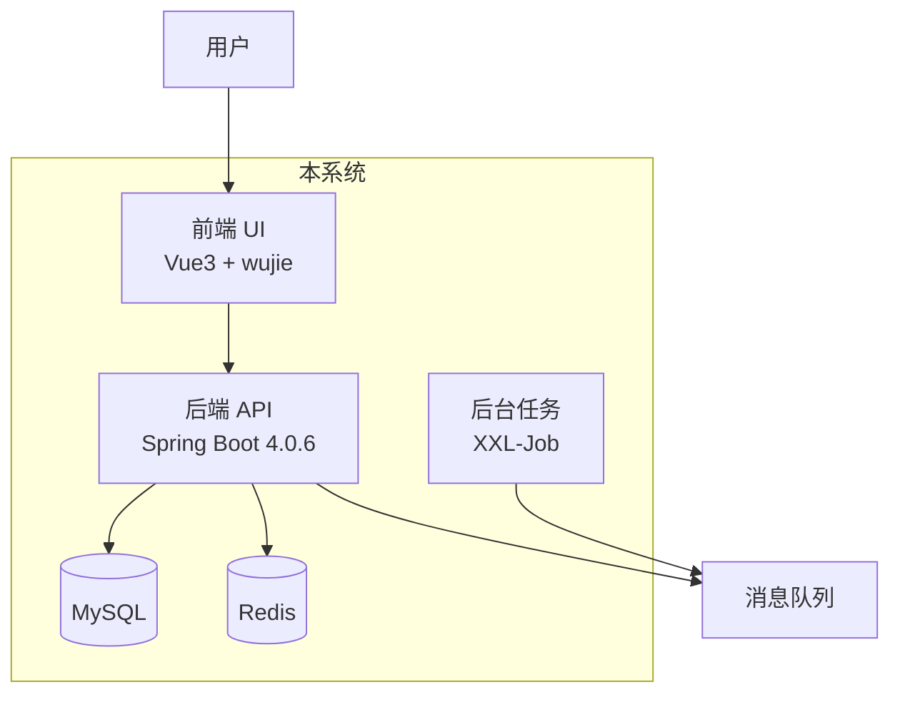

# AGENTS.md — 全栈项目 AI 规则

> 由 structure-agent-rules install.sh 自动生成。
> 安装的技术栈: vue3

## vue3


> 本文件自包含，可直接拷贝到 Vue 3 前端项目根目录，供 Codex / 通用 AI Agent 自动加载。
> 修改规则时，请同步更新 `wiki/` 目录下的对应角色文件。

## 1. 硬约束

- npm scope **MUST** `@structure-projects`（公开包）；私有包不要使用该 scope。
- **MUST** 技术栈：Vue 3 + Vite + TypeScript + Pinia + Vue Router + Element Plus + UnoCSS + wujie-vue3。
- **MUST** `*-ui` 是 wujie 微前端子应用，`private: true`。
- **MUST** `*-ui-components` 开发时 `file:` 本地引用，正式发布到 npm (`@structure-projects/{领域}-ui-components`)。
- **MUST** `@structure-projects/components` 按需命名导入（**不是 Vue 插件**）。
- **MUST** element-plus 由消费项目自行 `app.use(ElementPlus)` + 导入 CSS。
- **MUST** 子应用入口调用 `createWujieSubapp().init()`。
- **MUST** HTTP 请求用 `@structure-projects/gateway-client` 的 `request`。

## 2. 组件规范

- 文件名 PascalCase（`UserTable.vue`）
- `<script setup lang="ts">` 必须
- Props 用 `defineProps<T>()`，Emits 用 `defineEmits<T>()`
- L1: `@structure-projects/components`（npm），L2: `*-ui-components`（本地），L3: 页面组件（内部）

## 3. 状态管理（Pinia）

- Setup Store 语法（`defineStore('id', () => { ... })`）
- 按领域拆分（`stores/user.ts`、`stores/role.ts`）

## 4. 路由

- 懒加载：`() => import('@/views/xxx/Index.vue')`
- 权限路由从后端 `structure-resource/menus` API 获取
- meta 声明 `title`、`icon`、`keepAlive`

## 5. 样式

- UnoCSS 原子类为默认方式
- `<style scoped>` 用于组件特有样式
- 禁止内联 `style="..."`

## 6. 微前端（wujie）

- 子应用入口：`createWujieSubapp().init()`
- 基座：`structure-portal`
- 子应用 lifecycle 声明 `beforeMount`、`afterMount`、`beforeUnmount`

## 7. 构建

- Vite 构建工具
- TypeScript strict 模式
- `unplugin-auto-import`（Vue/Pinia API 自动导入）
- `unplugin-vue-components`（Element Plus 按需导入）

## 8. 测试

| 层级 | 工具 |
|---|---|
| 单元测试 | Vitest |
| 组件测试 | Vitest + Vue Test Utils |
| E2E | Playwright |

- 每功能开发后立即写单测，通过才能做下一个
- 业务完成后写 E2E
- 提交前 `npm run test` 全通过 + `npm run build` 编译通过

## 9. CI/CD

- GitHub Actions
- `test.yml`：npm ci + vitest + vue-tsc
- `build-and-push.yml`：Docker (nginx) 构建推送（`*-ui`）
- `publish.yml`：npm publish（仅 `*-ui-components`）
- Secrets：`NPM_TOKEN`、`DOCKER_USERNAME`、`DOCKER_PASSWORD`

## 10. 项目结构

```
structure-{X}-ui/
├── src/
│   ├── api/          # API 封装
│   ├── components/   # L3 页面级组件
│   ├── composables/  # 可复用组合函数
│   ├── layouts/      # 布局
│   ├── router/       # 路由
│   ├── stores/       # Pinia
│   ├── styles/       # 全局样式（极少用）
│   ├── views/        # 页面
│   ├── App.vue
│   └── main.ts       # createWujieSubapp().init()
├── vite.config.ts
├── tsconfig.json
├── uno.config.ts
└── package.json      # private: true
```

## _common


> 本文件是 **Codex / 通用 AI Agent** 在 structure-projects 业务项目中的通用工作规则。
> 由 [structure-agent-rules](https://github.com/structure-projects/structure-agent-rules) 仓库的 `_common/codex/AGENTS.md` 模板复制而来。
>
> **使用方式**：安装时自动合并到项目 `AGENTS.md`。
> **详细规则**：`wiki/_common/git.md` / `wiki/_common/version-management.md` / `wiki/_common/documentation.md` / `wiki/_common/naming.md` / `wiki/_common/project-structure.md` 等。

---

## 1. Git 分支管理（MUST）

### 分支模型

```
master ──────────────────────── ●(hotfix merge) ──────
  ↑                 ↑          ↑
develop ────●←feat-A─●←feat-B──●←release-1.2.0──●←fix-C──
            ↑        ↑         ↑                 ↑
          feat-A   feat-B   release-1.2.0      fix-C
```

### 分支命名

| 分支 | 用途 | 来源 | 合并目标 | 生命周期 |
|------|------|------|----------|----------|
| `master` | 生产环境稳定代码 | — | — | 永久 |
| `develop` | 开发主分支 | master | — | 永久 |
| `feat-{描述/版本}` | 功能开发 | develop | develop | 合并后删除 |
| `fix-{描述/版本}` | Bug 修复（开发环境） | develop | develop | 合并后删除 |
| `release-{版本号}` | 发布准备 | develop | master + develop | 合并后删除 |
| `hotfix-{版本号}` | 生产热修复 | master | master + develop | 合并后删除 |

### 核心约束

- **禁止** 直接在 `master` 或 `develop` 上推送代码。
- **禁止** 将 `feat-*` 分支直接合并到 `master`（必须经过 `develop`）。
- **禁止** 在生产热修复分支中夹带新功能。
- **禁止** 在未关联版本号的情况下提交代码。
- **MUST** 已发布的 commit 不可变，不 force push 公共分支。
- **MUST** 所有代码合并到 `develop` 前通过 CI 测试。

## 2. 版本管理（MUST）

### 版本格式

`X.Y.Z` 3 段式语义化版本：

| 段位 | 名称 | 自增时机 | 示例 |
|------|------|----------|------|
| **X** | 架构版本 | 架构级别调整（模块拆分/合并、框架大版本升级） | 1 → 2 |
| **Y** | 功能版本 | 新增功能 | 1.0 → 1.1 |
| **Z** | 修复版本 | Bug 修复（每次修复必增） | 1.1.0 → 1.1.1 |

### 核心约束

- **MUST** 版本号不可重复，不可回退。
- **MUST** 每次开发前确认目标版本号（X/Y/Z 哪段自增）。
- **MUST** Y 自增时 Z 归 0；X 自增时 Y 和 Z 归 0。
- **MUST** 开发阶段使用 `{X}.{Y}.{Z}-SNAPSHOT`，发布时去掉 `-SNAPSHOT`。
- **MUST** 分支命名与版本号对应：`feat-1.2.0` 对应功能版本 `1.2.0`。
- **MUST** 发布前检查 `README.md` 是否与当前版本代码一致。
- **禁止** 在 README 过期的情况下发布版本。

## 3. 文档管理（MUST）

### 文档目录结构

```
docs/
├── overview.md                 # 概要设计
├── features/                   # 详细设计
├── {version}/                  # 版本快照
│   └── changelog/
│       ├── 001.md
│       └── ...
└── README.md
```

### AI 开发前置验证（编码前 MUST 执行）

1. **确认目标版本号**：X/Y/Z 哪段自增？
2. **验证设计文档存在**：`docs/features/` 下是否有对应的详细设计文档？
3. **确认预期交付**：从设计文档提取交付物清单并确认。
4. **禁止**在设计文档不存在或版本号不明确的情况下开始编码。

### Changelog 格式（每次变更 MUST 写入）

`docs/{version}/changelog/{序号}.md`：

```markdown
# 变更 #{序号}
- **类型**: feat / fix
- **日期**: YYYY-MM-DD
- **涉及文件**: xxx.java, xxx.sql, ...
- **原始设计**: [引用详细设计文档]
- **变更内容**: 本次修改的具体内容
- **测试结果**: 通过 / 失败 + 影响范围
- **修改人**: xxx
```

### 红线

- **设计文档缺失** → 禁止编码
- **版本号不明** → 禁止编码
- **changelog 未更新** → 禁止提交

## 4. 命名规范

### 通用命名（MUST）

| 元素 | 规范 | 示例 |
|------|------|------|
| 类名/接口名 | `UpperCamelCase` | `UserService`, `OrderRepository` |
| 方法名/变量名 | `lowerCamelCase` | `findById`, `userName` |
| 常量 | `UPPER_SNAKE_CASE` | `MAX_RETRY_COUNT` |
| 包名 | 全小写无分隔符 | `cn.structured.admin.biz.service` |
| 数据库表/字段 | `lower_snake_case` | `user_role`, `create_time` |
| REST API URL | `kebab-case` | `/api/user-roles` |

### Java 注释规范（MUST）

**类头注释**：

```java
/**
 * 用户管理服务实现
 *
 * @author zhangsan
 * @version 1.2.0
 * @since JDK 17 2025-07-31
 */
```

- **MUST** `@version` 与项目版本号同步更新。
- **SHOULD** `@since` 记录首次创建的 JDK 版本与日期。

**方法注释**：每个 public/protected 方法 MUST 包含 `@param` 和 `@return`。

## 5. 项目结构（MUST）

### 文档目录

```
docs/
├── overview.md                 # 概要设计
├── features/                   # 详细设计
├── {version}/                  # 版本快照
└── README.md                   # 文档索引
```

### 禁止事项

- **禁止** 将生成代码与手写代码混放在同一目录。
- **禁止** 在 commit 中包含临时文件、IDE 配置、构建产物。
- **禁止** 在 `README.md` 中写入超前于代码的内容。

---

**详细规则**（如能访问 structure-agent-rules 仓库）：`wiki/_common/git.md` / `wiki/_common/version-management.md` / `wiki/_common/documentation.md` / `wiki/_common/naming.md` / `wiki/_common/project-structure.md`。


---

## 技能规程（Skills）

> codex 无独立 skill 调用机制，以下技能规程作为常驻指令嵌入，对应动作时必须遵循。

### 技能：api-design


#### API 设计

> 按 RESTful 规范设计 API 契约。**MUST 含版本号、幂等性、错误码、分页约定**。

##### 前置条件

- 变更提案存在
- 已识别项目栈

##### 执行步骤

###### 第 1 步：确定 API 类型

| 类型 | 前缀 | 说明 |
|---|---|---|
| **内部 API** | `/api/{资源}` | 前端 / 内部服务调用，需认证 |
| **开放 API** | `/api/open/{资源}` | 第三方服务调用，需签名 / 开放认证 |

###### 第 2 步：设计 API 路径（MUST 遵守）

- MUST `kebab-case`：`/api/user-roles`（不是 `/api/userRoles`）
- MUST 用名词复数：`/users`（不是 `/user`）
- MUST 含版本号：`/api/v1/users`
- MUST NOT 含动词：`/api/users`（不是 `/api/getUsers`）

###### 第 3 步：设计 HTTP 方法

| 操作 | 方法 | 路径示例 | 幂等 |
|---|---|---|---|
| 查询单条 | GET | `/api/v1/users/{id}` | ✅ |
| 查询列表 | GET | `/api/v1/users` | ✅ |
| 分页查询 | GET | `/api/v1/users/page` | ✅ |
| 创建 | POST | `/api/v1/users` | ❌（需幂等键） |
| 全量更新 | PUT | `/api/v1/users/{id}` | ✅ |
| 部分更新 | PATCH | `/api/v1/users/{id}` | ❌ |
| 删除 | DELETE | `/api/v1/users/{id}` | ✅ |

###### 第 4 步：设计请求/响应

####### 请求

- 路径参数：`@PathVariable Long id`
- 查询参数：`@RequestParam String username`
- 请求体：`@RequestBody @Valid UserDTO`
- 分页：`page(UserQuery query, ReqPage reqPage)`

####### 响应

```java
// 统一响应包装
ResResultVO<UserVO>

// 分页响应
ResResultVO<ResPage<UserVO>>

// 构造
ResultUtilSimpleImpl.success(data)
ResultUtilSimpleImpl.fail(code, message)
```

###### 第 5 步：设计错误码

```java
public enum UserExceptionEnum {
    USER_NOT_FOUND("USER_001", "用户不存在"),
    USERNAME_DUPLICATED("USER_002", "用户名已存在"),
    ...
}
```

**规则**：
- 错误码格式：`{MODULE}_{3 位数字}`
- MUST 在 `{X}ExceptionEnum` 集中管理
- MUST 抛 `CommonException`

###### 第 6 步：幂等性设计

非幂等操作（POST / PATCH）MUST 支持幂等：
- 客户端传 `Idempotency-Key` header
- 服务端去重（Redis SETNX）

###### 第 7 步：生成 OpenAPI 注解

```java
@Tag(name = "用户管理")
@RestController
@RequestMapping("/api/v1/users")
public class UserController {

    @Operation(summary = "根据 ID 查询用户")
    @GetMapping("/{id}")
    public ResResultVO<UserVO> findById(@PathVariable Long id) {
        return ResultUtilSimpleImpl.success(userService.findById(id));
    }
}
```

##### 产出物

- API 契约文档
- Controller 接口骨架
- DTO / VO 定义
- 错误码枚举
- OpenAPI / Swagger 注解

##### 完成标准

- 路径符合 RESTful
- 响应统一 `ResResultVO<T>`
- 错误码集中管理
- 非幂等操作支持幂等键
- OpenAPI 注解完整

##### 关联

- 前置：`requirement-analysis`
- 后续：`coding`
- Wiki：`wiki/_common/api-design.md` `wiki/<stack>/swagger.md`

### 技能：api-documentation


#### API 文档生成

> 生成 OpenAPI / Swagger 文档。

##### 关键约束

- ✅ **MUST** 用 `springdoc-openapi`（Spring Boot 4）
- ✅ **MUST** 每个 Controller 有 `@Tag`
- ✅ **MUST** 每个方法有 `@Operation`
- ✅ **MUST** 每个参数有 `@Parameter`
- ❌ **MUST NOT** 用 swagger 2.x 老注解（`@Api` / `@ApiOperation`）

##### 示例

```java
@Tag(name = "用户管理", description = "用户相关 API")
@RestController
@RequestMapping("/api/v1/users")
public class UserController {

    @Operation(summary = "根据 ID 查询用户", description = "返回用户详情")
    @GetMapping("/{id}")
    public ResResultVO<UserVO> findById(
            @Parameter(description = "用户 ID", required = true)
            @PathVariable Long id) {
        return ResultUtilSimpleImpl.success(userService.findById(id));
    }
}
```

##### 访问文档

```
http://localhost:8080/swagger-ui/index.html
```

##### 关联

- Wiki：`wiki/_common/api-design.md`
- 相关：`api-design`

### 技能：archive-change


#### 变更归档

> SDLC 的最后一环：归档变更提案，更新 changelog，更新 README。
> **禁止跳过归档** —— 未归档的变更无法追溯。

##### 前置条件（MUST 全部满足）

1. **tasks.md 全部勾选**：`changes/proposals/<current>/tasks.md` 无 `- [ ]` 未完成项
2. **review.md 无未解决 MUST fix**
3. **部署验证通过**（或本地变更无需部署）
4. **当前分支为 feat-* / fix-* / hotfix-***

任一不满足 → 禁止归档。

##### 执行步骤

###### 第 1 步：最终检查

```bash
#### 检查 tasks.md
grep -c "^- \[ \]" changes/proposals/<current>/tasks.md
#### 预期：0

#### 检查 review.md 是否有 MUST fix
grep -A 10 "MUST fix" changes/proposals/<current>/review.md
#### 预期：无未勾选
```

###### 第 2 步：更新 changelog

写入 `changes/changelog/<version>.md`（如 `1.2.0.md`）：

```markdown
##### [1.2.0] - 2026-08-15

###### Added
- 新增用户登录接口（proposal: 2026-08-15-add-user-login）

###### Changed
- ...

###### Fixed
- ...
```

条目 MUST 包含：
- 类型（Added / Changed / Fixed / Security / Deprecated / Removed）
- 简短描述
- 关联 proposal ID

###### 第 3 步：更新 README（如有需要）

检查是否需要更新 README：
- 新增 API → 更新 API 列表
- 新增功能 → 更新功能列表
- 修改启动方式 → 更新快速开始
- 依赖变更 → 更新技术栈

**MUST 更新 README 的情况**：
- 影响用户使用方式的变更
- 新增模块 / 新增加载项
- 版本号变化

###### 第 4 步：归档提案

```bash
git mv changes/proposals/<id>/ changes/archive/<id>/
```

###### 第 5 步：提交归档

```bash
git add changes/ README.md
git commit -m "docs(changes): 归档变更 <id>，更新 changelog <version>"
```

###### 第 6 步：（可选）合并到 develop / master

```bash
#### 功能分支合并到 develop
git checkout develop
git merge --no-ff feat-<name>

#### hotfix 合并到 master + develop
git checkout master
git merge --no-ff hotfix-<version>
git checkout develop
git merge --no-ff hotfix-<version>
```

##### 产出物

- `changes/archive/<id>/`（完整提案目录）
- 更新 `changes/changelog/<version>.md`
- 更新 `README.md`（如需要）
- 合并 commit

##### 完成标准

- 提案目录已从 proposals/ 移到 archive/
- changelog 含本次变更条目
- README 已更新（如需要）
- 归档 commit 已提交

##### 下一步（可选）

归档完成后，可选继续：

- **打 Tag + 发 Release** → 调用 `gh-release` 技能
- **触发发布流水线** → 用 `gh workflow run` 触发对应 workflow（Maven / npm / Docker）
- **结束本次变更** → 无后续

##### 关联

- 前置：`deployment-verification`
- 后续（可选）：`gh-release`
- Wiki：`wiki/_common/version-management.md` `wiki/_common/documentation.md`

### 技能：changelog-generation


#### Changelog 生成

> 按 Keep a Changelog 规范生成变更日志。

##### 格式

```markdown
##### [X.Y.Z] - YYYY-MM-DD

###### Added
- <新功能>（proposal: <id>）

###### Changed
- <变更>（proposal: <id>）

###### Deprecated
- <废弃>

###### Removed
- <移除>

###### Fixed
- <修复>（proposal: <id>）

###### Security
- <安全>
```

##### 执行步骤

###### 第 1 步：读已归档提案

```bash
ls changes/archive/
```

###### 第 2 步：按类型分组

- feat → Added
- fix → Fixed
- refactor → Changed
- ...

###### 第 3 步：生成 changelog

写入 `changes/changelog/<version>.md`

###### 第 4 步：提交

```bash
git add changes/changelog/
git commit -m "docs(changelog): 更新 <version> 变更日志"
```

##### 关联

- Wiki：`wiki/_common/version-management.md`
- 相关：`archive-change` / `gh-release`

### 技能：ci-gate


#### CI 门禁

> 提交代码的物理门禁。本地预检 + git hooks + CI 监控。
> 即使绕过其他 skills，本层也拦得住。

##### 前置条件（MUST 全部满足）

1. **编码完成**：`tasks.md` 所有任务勾选
2. **测试通过**：本地测试全部通过
3. **评审完成**：`changes/proposals/<current>/review.md` 存在，无未解决的 MUST fix

##### 分级检查

###### MUST 检查（任何提交都必须通过）

- commit-msg 格式（Conventional Commits）
- 分支名（`feat-*` / `fix-*` / `hotfix-*` / `release-*`）
- 编译通过（`mvn clean package -DskipTests` / `npm run build` / ...）
- 核心单测通过

###### SHOULD 检查（hotfix 可降级）

- 覆盖率 ≥ 80%
- 全量测试通过
- lint 无 error
- 安全扫描通过

##### 执行步骤

###### 第 1 步：本地预检

```bash
#### 分支检查
git branch --show-current | grep -E "^(feat|fix|hotfix|release)-"

#### 编译
mvn clean package -DskipTests  # 或 npm run build / pytest

#### 核心单测
mvn test  # 或 npm test / pytest
```

###### 第 2 步：生成 commit message

调用 `git-commit` 子技能：
- 按 Conventional Commits 生成 `<type>(<scope>): <description>`
- 校验 commit-msg hook

###### 第 3 步：提交

```bash
git commit -m "<message>"
```

###### 第 4 步：推送

```bash
git push origin <branch>
#### 首次推送：
git push -u origin <branch>
```

###### 第 5 步：监控远程 CI

- 追踪 CI 状态（GitHub Actions / GitLab CI / Jenkins）
- 失败 MUST 修复，不允许"先合并再说"

##### Hotfix 快速通道

紧急 hotfix 时可降级 SHOULD 检查：
- 跳过覆盖率检查
- 跳过全量测试（仅跑核心单测）
- 事后 24h 内补跑完整 CI

MUST 检查任何情况都不可跳过。

##### 完成标准

- commit-msg hook 通过
- 编译通过
- 核心单测通过
- 远程 CI 通过
- 推送成功

##### 关联

- 前置：`coding` `unit-testing` `expert-review`
- 后续：`deployment-verification`
- 子技能：`git-commit`
- Wiki：`wiki/_common/git.md` `wiki/_common/ci-cd-pipeline.md`
- 物理拦截：`_common/checks/commit-msg.sh`

### 技能：ci-pipeline-design


#### CI/CD 流水线设计

> 按生态三件套模板生成 GitHub Actions 流水线。**MUST 手动触发，禁止自动发布**。

##### 前置条件

- 项目已有 Dockerfile（`dockerfile-writing` 技能产出）
- 已确定镜像仓库 / npm scope / Maven 仓库

##### 执行步骤

###### 第 1 步：确定流水线需求

**MUST 询问用户**：

```
Q1: 项目类型？
    a) 后端 Java（需要 build-and-push + release-maven）
    b) 前端（需要 build-and-push）
    c) npm 组件库（需要 publish-npm）
    d) 全栈（三件套都需要）

Q2: 镜像仓库？
    默认：registry.cn-hangzhou.aliyuncs.com/structured

Q3: 是否发布到 Maven Central / npmjs？
    a) 是
    b) 否（仅构建 Docker 镜像）
```

###### 第 2 步：生成对应 workflow

按用户选择生成对应的 `.github/workflows/*.yml` 文件。

**模板来源**：`wiki/_common/ci-cd-pipeline.md` 中的三件套模板。

**关键替换**：
- `structure-${{ inputs.module }}` → 实际项目路径
- `structure-${{ inputs.component }}` → 实际组件路径
- Secrets 名称 → 保持不变（约定俗成）

###### 第 3 步：配置 Secrets

**MUST 告诉用户需要配置哪些 Secrets**：

```bash
#### 通过 gh CLI 设置
gh secret set ALIYUN_ACR_USERNAME --body "..."
gh secret set ALIYUN_ACR_PASSWORD --body "..."
gh secret set OSSRH_USERNAME --body "..."        # Java 项目
gh secret set OSSRH_PASSWORD --body "..."        # Java 项目
gh secret set GPG_PRIVATE_KEY --body "..."       # Java 项目
gh secret set GPG_PASSPHRASE --body "..."        # Java 项目
gh secret set NPM_TOKEN --body "..."             # npm 项目
```

###### 第 4 步：验证流水线

```bash
#### 本地验证 yaml 语法
yamllint .github/workflows/*.yml

#### 提交并推送
git add .github/workflows/
git commit -m "ci(workflows): 新增三件套流水线"
git push

#### 手动触发验证
gh workflow run build-and-push.yml -f module=<module> -f version=<version>
```

###### 第 5 步：监控运行

```bash
gh run list
gh run view <run-id>
gh run view <run-id> --log  # 查看日志
```

##### 关键约束（MUST 遵守）

- ❌ **MUST NOT** 使用 `on: release: published` 自动触发发布
- ✅ **MUST** 所有发布用 `workflow_dispatch` 手动触发
- ✅ **MUST** 使用缓存（Maven / npm）加速构建
- ✅ **MUST** 镜像打 `version` + `latest` 双 tag
- ✅ **MUST** npm 发布校验 scope 和 private

##### 产出物

- `.github/workflows/build-and-push.yml`
- `.github/workflows/release-maven.yml`（Java 项目）
- `.github/workflows/publish-npm.yml`（npm 组件）
- Secrets 配置说明

##### 完成标准

- 流水线 yaml 语法正确
- 手动触发成功
- 产物（镜像 / 包）成功推送

##### 关联

- 前置：`dockerfile-writing`
- 后续：`gh-pr-workflow`（通过 PR 合并流水线变更）
- Wiki：`wiki/_common/ci-cd-pipeline.md` `wiki/_common/github-workflow.md`

### 技能：codebase-audit


#### 代码审计

> 老项目接入的第一步：现状扫描，产出 audit-report。

##### 执行步骤

###### 第 1 步：扫描项目结构

```bash
#### 项目类型
ls pom.xml package.json go.mod Cargo.toml 2>/dev/null

#### 目录结构（顶层 2 层）
tree -L 2 -d

#### 代码规模
find . -name "*.java" | wc -l
find . -name "*.ts" -o -name "*.vue" | wc -l

#### Git 历史
git log --oneline | wc -l
git log --since="6 months ago" | wc -l
```

###### 第 2 步：规范符合性检查

按维度检查：

| 维度 | 检查项 | 工具 |
|---|---|---|
| **命名** | 类名 / 方法名 / 常量 / 包名 | grep |
| **分支策略** | 当前分支 / 分支列表 | `git branch -a` |
| **Commit 规范** | 最近 20 条 commit message | `git log --oneline -20` |
| **架构分层** | 模块划分 / 依赖方向 | 目录结构 |
| **异常处理** | 是否用 CommonException | grep "throw new" |
| **日志规范** | 是否用 slf4j / 是否含敏感信息 | grep "log\." |
| **API 设计** | 是否 RESTful / 统一响应 | grep "@RestController" |
| **安全** | SQL 注入 / 敏感信息 | grep "\${" 等 |

###### 第 3 步：测试评估

```bash
#### 测试覆盖率
mvn test jacoco:report  # Java
npm test -- --coverage  # Node
pytest --cov            # Python

#### 统计测试文件
find . -name "*Test.java" | wc -l
find . -name "*.test.ts" | wc -l
```

###### 第 4 步：CI/CD 评估

```bash
ls .github/workflows/ 2>/dev/null
ls .gitlab-ci.yml 2>/dev/null
ls Jenkinsfile 2>/dev/null
```

###### 第 5 步：文档评估

- README 完整度
- 架构文档
- API 文档
- 变更日志

###### 第 6 步：产出 audit-report.md

按 `changes/templates/audit-report.md` 模板填充：

```markdown
#### 现状审计报告：<项目名>

##### 项目概览
- 技术栈 / 模块数 / 代码规模 / 提交历史

##### 规范符合性评估
| 维度 | 符合度 | 说明 |

##### 测试评估
##### CI/CD 评估
##### 文档评估
##### 主要不合规点
##### 改造建议
###### 优先级 P0 / P1 / P2
##### 迁移建议
```

##### 产出物

- `changes/proposals/0000-legacy-onboarding/audit-report.md`

##### 完成标准

- 所有维度都检查过
- 主要不合规点列出
- 改造建议分优先级

##### 下一步

调用 `migration-planning` 制定迁移计划。

##### 关联

- 调用方：`legacy-onboarding`
- 后续：`migration-planning`
- Wiki：`wiki/_common/legacy-onboarding.md`

### 技能：coding


#### 编码实现

> 按变更提案编码。MUST 按 tasks.md 逐项完成 + 写单测。

##### 前置条件（MUST 全部满足）

1. **变更提案存在**：`changes/proposals/<current>/proposal.md` 存在
2. **任务清单存在**：`changes/proposals/<current>/tasks.md` 有未完成任务
3. **分支正确**：当前分支匹配 `^(feat|fix|hotfix)-*`

任一不满足 → MUST 停止并提示：
- 无提案 → 调用 `requirement-analysis` 技能
- 分支错误 → 切到 `feat-*` / `fix-*` 分支

##### 执行步骤

###### 第 0 步：判断目录类型（如涉及"新建目录/子目录/特性"）⭐

如果用户请求中涉及"新建目录/子目录/特性/模块"，MUST 先判断目录类型：

| 用户表达 | 目录类型 | 行动 |
|---|---|---|
| "新建包 / 子包 / package" | 包目录 | 按 Java 包规范创建（影响 package 语句） |
| "新建特性 / feature / 业务模块" | 特性目录 | 调用 `create-feature` 技能（跨层组织） |
| "新建文档/脚本/示例目录" | 非代码目录 | 创建独立目录（docs/scripts/examples） |
| "新建子目录"（未明确） | **MUST 询问** | 让用户确认类型 |

**禁止**：
- ❌ MUST NOT 把"子目录"默认按"子包"处理
- ❌ MUST NOT 在 `src/main/java/` 下创建非代码目录

详见 `common-project-structure` 规则的"目录类型识别"章节。

###### 第 1 步：读变更提案

```bash
cat changes/proposals/<current>/proposal.md
cat changes/proposals/<current>/tasks.md
#### 复杂变更：
cat changes/proposals/<current>/design.md
```

###### 第 2 步：读相关 Wiki（TODO 阶段 3 填充栈级引用）

MUST Read：
- `wiki/_common/naming.md`
- `wiki/_common/architecture.md`
- `wiki/<stack>/developer.md`

###### 第 3 步：按 tasks.md 逐项实现

对每一项未完成任务：
1. 读任务描述
2. 写代码（遵守所有相关 rules 约束）
3. 写对应单测（MUST 与代码同步完成）
4. 本地验证：编译通过 + 相关单测通过
5. 勾选任务：在 tasks.md 中将 `- [ ]` 改为 `- [x]`

**关键约束**：
- MUST 完成一项再做下一项
- MUST 代码 + 单测同步完成
- 遇到 proposal 未覆盖的边界 → MUST 回到 `requirement-analysis` 补充 proposal

###### 第 4 步：全部完成后的本地验证（TODO 阶段 3 填充栈级命令）

###### 第 5 步：自评

- 代码是否实现 proposal 所有目标？
- 是否触碰了非目标范围？
- 是否有 proposal 未预见的问题？

##### 产出物

- 源代码（符合 rules 约束）
- 单元测试（覆盖率 ≥ 80%）
- 更新的 `changes/proposals/<current>/tasks.md`

##### 完成标准

- tasks.md 所有任务勾选完成
- 本地编译通过
- 本地测试全部通过
- 代码符合所有 rules 约束

##### 下一步

- 并行：调用 `unit-testing` 完善测试 / 调用 `expert-review` 评审代码
- 然后：调用 `ci-gate` 提交代码

##### 关联

- 前置：`requirement-analysis`
- 并行：`unit-testing` `expert-review`
- 后续：`ci-gate`
- Wiki：`wiki/<stack>/developer.md`
- 规则：`<stack>-developer` `common-naming`

### 技能：create-feature


#### 新建特性 / 子目录

> 按目录类型创建对应结构。**MUST 先询问目录类型，禁止默认按"子包"处理**。

##### 前置条件

- 用户明确要新建目录 / 特性 / 功能模块

##### 执行步骤

###### 第 1 步：询问目录类型（MUST）

```
您要创建的目录是哪种类型？

a) 特性目录（feature directory）
   - 独立功能模块，跨层组织代码
   - 示例：features/user-management/{controller,service,repository}/
   - 不影响现有包结构

b) 子包（subpackage）
   - 在现有 Java package 下创建子包
   - 示例：cn.structured.user.features.UserController
   - 会影响 package 语句和 import

c) 非代码目录
   - 不放 Java 源代码
   - 示例：docs/、scripts/、examples/、assets/

请回复 a / b / c：
```

###### 第 2 步：按类型创建

####### 类型 a：特性目录

```
features/<feature-name>/
├── README.md                   # 特性说明
├── controller/                 # 控制器（或按语言调整）
│   └── {X}Controller.java
├── service/                    # 业务逻辑
│   └── {X}Service.java
├── repository/                 # 数据访问
│   └── {X}Repository.java
├── model/                      # 模型
│   ├── {X}Entity.java
│   ├── {X}DTO.java
│   └── {X}VO.java
└── tests/                      # 测试
    └── {X}ServiceTest.java
```

**关键**：
- 跨层组织（controller / service / repository 在同一特性目录下）
- 不影响现有包结构
- 适合独立功能模块、实验性功能

####### 类型 b：子包

在现有 package 下创建子包：

```
src/main/java/cn/structured/{X}/
├── application/        # 现有
├── domain/             # 现有
└── features/           # 新增子包
    └── {Y}Controller.java
```

**关键**：
- 影响 `package` 语句
- 影响 `import`
- 需要符合 Java 命名规范

####### 类型 c：非代码目录

```
<directory-name>/
└── README.md           # 说明文档
```

**关键**：
- 不放 Java 源代码
- 通常放 markdown / 脚本 / 资源文件

###### 第 3 步：生成 README（特性目录 / 非代码目录 MUST）

特性目录的 README.md：

```markdown
#### <特性名>

##### 用途
<这个特性是做什么的>

##### 目录结构
<文件列表>

##### 使用方式
<如何使用这个特性>

##### 依赖
<依赖的其他模块 / 服务>
```

###### 第 4 步：验证

```bash
#### 特性目录
tree features/<feature-name>/  # 或 ls -R

#### 子包（编译验证）
mvn clean compile  # 或 npm run build
```

##### 产出物

- 特性目录结构（含 README）
- 或子包结构
- 或非代码目录

##### 完成标准

- 目录类型经用户确认
- 结构与类型匹配
- README 就位（特性 / 非代码目录）
- 编译通过（如适用）

##### 关联

- 前置：无
- 后续：在特性目录下开发 → `coding` 或栈级 `new-*` 技能
- Wiki：`wiki/_common/project-structure.md`
- 规则：`common-project-structure`

### 技能：database-design


#### 数据库设计

> 产出表结构与迁移脚本。**MUST 含审计字段、逻辑删除、合适索引**。

##### 前置条件

- 模型设计已完成（`model-design` 技能产出）

##### 执行步骤

###### 第 1 步：设计表结构

```sql
CREATE TABLE `user` (
  `id` BIGINT NOT NULL AUTO_INCREMENT COMMENT '主键',
  `tenant_id` BIGINT NOT NULL COMMENT '租户 ID',
  `username` VARCHAR(64) NOT NULL COMMENT '用户名',
  `password` VARCHAR(128) NOT NULL COMMENT '密码（加密存储）',
  `email` VARCHAR(128) COMMENT '邮箱',
  `mobile` VARCHAR(32) COMMENT '手机号',
  `status` TINYINT NOT NULL DEFAULT 1 COMMENT '状态：1 启用 0 禁用',
  `create_time` DATETIME NOT NULL DEFAULT CURRENT_TIMESTAMP COMMENT '创建时间',
  `update_time` DATETIME NOT NULL DEFAULT CURRENT_TIMESTAMP ON UPDATE CURRENT_TIMESTAMP COMMENT '更新时间',
  `is_deleted` TINYINT NOT NULL DEFAULT 0 COMMENT '逻辑删除：0 正常 1 已删',
  PRIMARY KEY (`id`),
  UNIQUE KEY `uk_tenant_username` (`tenant_id`, `username`),
  KEY `idx_email` (`email`),
  KEY `idx_mobile` (`mobile`)
) ENGINE=InnoDB DEFAULT CHARSET=utf8mb4 COMMENT='用户表';
```

###### 第 2 步：关键约束（MUST 遵守）

| 约束 | 说明 |
|---|---|
| 主键 | `id BIGINT AUTO_INCREMENT`（不用 UUID，除非分库分表） |
| 审计字段 | `create_time` / `update_time` / `is_deleted` / `tenant_id` MUST 存在 |
| 逻辑删除 | `is_deleted TINYINT` + MyBatis-Plus `@TableLogic` |
| 命名 | 表名/字段名 MUST `lower_snake_case` |
| 字符集 | `utf8mb4` |
| 引擎 | `InnoDB` |
| 注释 | 每个表 / 字段 MUST 有 `COMMENT` |

###### 第 3 步：设计索引

**MUST 索引**：
- 主键（PRIMARY KEY）
- 唯一约束（UNIQUE KEY）
- 高频查询字段（KEY）
- 外键关联字段（KEY）
- 多租户字段（tenant_id，几乎所有查询都带）

**禁止**：
- 在低选择性字段建索引（如 status 只有 0/1）
- 超过 5 个索引（影响写入性能）

###### 第 4 步：生成 Flyway 迁移脚本

文件位置：`<stack>-repository-mybatis/src/main/resources/db/migration/`

命名规范：`V{version}__{description}.sql`

示例：`V1_2_0__add_user_table.sql`

```sql
-- V1_2_0__add_user_table.sql
-- 新增用户表

CREATE TABLE `user` (
  -- ... 上述 DDL
);
```

###### 第 5 步：数据字典

写入 design.md：

```markdown
##### 数据字典

###### user 表

| 字段 | 类型 | 说明 |
|---|---|---|
| id | BIGINT | 主键 |
| username | VARCHAR(64) | 用户名（租户内唯一） |
| ...
```

##### 产出物

- 数据表 DDL
- Flyway 迁移脚本
- 索引设计
- 数据字典

##### 完成标准

- 表结构含所有审计字段
- 索引设计合理
- 迁移脚本可执行（在测试库验证）
- 命名符合规范

##### 关联

- 前置：`model-design`
- 后续：`coding`
- Wiki：`wiki/_common/database-design.md`

### 技能：database-migration-cd


#### 数据库迁移 CD

> 在 CI/CD 流水线中安全执行数据库迁移。**生产迁移 MUST 用户确认 + 备份**。

##### 核心原则

- ✅ **MUST** 迁移脚本与应用代码同 PR 提交（保持版本一致）
- ✅ **MUST** 迁移在应用部署**之前**执行（先 DB 后 App）
- ✅ **MUST** 迁移前备份生产数据库
- ✅ **MUST** 迁移失败时应用部署中止
- ❌ **MUST NOT** 在生产环境跳过备份直接迁移

##### Flyway 迁移工作流

###### 在 CI 流水线中的位置

```
代码提交 → 单测 → 打包 → 镜像构建
                              ↓
                       DB 迁移（测试）→ 应用部署（测试）
                              ↓
                       测试验证
                              ↓
                       生产审批（人工）
                              ↓
                       DB 备份（生产）
                              ↓
                       DB 迁移（生产）
                              ↓
                       应用部署（生产）
                              ↓
                       健康检查
```

###### GitHub Actions 集成

```yaml
#### .github/workflows/deploy.yml
jobs:
  migrate-test:
    runs-on: ubuntu-latest
    steps:
      - uses: actions/checkout@v4

      - name: Run Flyway migrate (test)
        run: |
          mvn flyway:migrate \
            -Dflyway.url=jdbc:mysql://test-mysql:3306/mydb \
            -Dflyway.user=${{ secrets.DB_USER }} \
            -Dflyway.password=${{ secrets.DB_PASSWORD }}

  deploy-test:
    needs: migrate-test  # 迁移成功后才部署
    # ...

  migrate-prod:
    needs: approval  # 人工审批后
    runs-on: ubuntu-latest
    steps:
      - name: Backup production DB
        run: |
          mysqldump -h prod-mysql -u ${{ secrets.DB_USER }} -p${{ secrets.DB_PASSWORD }} mydb > backup-$(date +%Y%m%d-%H%M%S).sql

      - name: Run Flyway migrate (prod)
        run: |
          mvn flyway:migrate \
            -Dflyway.url=jdbc:mysql://prod-mysql:3306/mydb \
            -Dflyway.user=${{ secrets.DB_USER }} \
            -Dflyway.password=${{ secrets.DB_PASSWORD }}
```

##### 迁移脚本规范

###### 命名

```
V<version>__<description>.sql
```

示例：
- `V1_2_0__add_user_table.sql`
- `V1_2_1__add_user_index.sql`

###### 位置

```
<module>-repository-mybatis/
└── src/main/resources/
    └── db/migration/
        ├── V1_0_0__init.sql
        ├── V1_1_0__add_user_table.sql
        └── V1_2_0__add_order_table.sql
```

###### 关键约束

- ✅ **MUST** 版本号单调递增
- ✅ **MUST** 一个脚本一个目的
- ❌ **MUST NOT** 修改已发布的迁移脚本
- ❌ **MUST NOT** 在迁移脚本里使用数据库特定语法（除非必要）

##### 回滚策略

###### 向前回滚（推荐）

不写 `down` 迁移，而是写新的 `up` 迁移回退：

```sql
-- V1_2_1__rollback_user_email_index.sql
DROP INDEX idx_email ON user;
```

###### 数据库备份 + 恢复（生产兜底）

```bash
#### 迁移前备份
mysqldump -h host -u user -p mydb > backup-$(date +%Y%m%d-%H%M%S).sql

#### 迁移失败恢复
mysql -h host -u user -p mydb < backup-20260815-103000.sql
```

##### 验证

```bash
#### 本地验证迁移
mvn flyway:migrate -Dflyway.url=jdbc:h2:mem:test

#### 查看迁移历史
mvn flyway:info

#### 校验迁移脚本
mvn flyway:validate
```

##### 关键约束（MUST 遵守）

- ✅ **MUST** 生产迁移前备份
- ✅ **MUST** 迁移失败时应用部署中止
- ✅ **MUST** 迁移脚本与应用代码同 PR
- ❌ **MUST NOT** 跳过备份直接迁移生产
- ❌ **MUST NOT** 修改已发布的迁移脚本

##### 关联

- 前置：`database-design`
- Wiki：`wiki/_common/database-design.md` `wiki/_common/ci-cd-pipeline.md`
- 相关：`ci-pipeline-design` / `deployment-verification`

### 技能：debug-issue


#### 调试问题

> 系统性调试：收集 → 复现 → 定位 → 修复 → 验证。**禁止凭直觉猜测**。

##### 执行步骤

###### 第 1 步：收集信息（MUST 完整）

收集以下信息：
- **错误信息**：完整的错误消息、堆栈
- **复现步骤**：如何重现问题
- **环境信息**：哪个环境（本地 / 测试 / 生产）、什么版本
- **最近变更**：最近改了什么代码 / 配置 / 依赖
- **影响范围**：影响哪些用户 / 功能

```bash
#### 收集日志
tail -100 logs/application.log

#### 收集最近的 git 变更
git log --oneline -10
git diff HEAD~1
```

###### 第 2 步：复现问题

在本地 / 测试环境尝试复现：
- 能复现 → 继续第 3 步
- 不能复现 → 回到第 1 步收集更多信息（可能是环境差异）

###### 第 3 步：定位根因

按层次排查：

```
1. 输入层：请求参数是否正确？
2. 业务层：业务逻辑是否有 bug？
3. 数据层：SQL 是否正确？数据是否异常？
4. 外部依赖：下游服务是否正常？
5. 配置层：配置是否正确？
6. 环境层：JDK / 框架版本是否兼容？
```

**工具**：
- 日志：`grep` 关键错误
- 调试：打断点（如本地）
- 测试：写单元测试复现
- 监控：看指标异常

###### 第 4 步：分析根因

**禁止**：
- 只看表面错误就修
- 没复现就修
- 凭印象修

**必须**：
- 找到真正的根因（不是表象）
- 理解为什么会出现这个问题
- 评估影响范围

###### 第 5 步：制定修复方案

**MUST 与用户确认**：
- 修复方式是否合适
- 是否需要数据修复
- 是否需要变更提案（大改动）

小改动（typo / 配置）→ 直接修复
大改动（逻辑变更）→ 走 `requirement-analysis` 创建变更提案

###### 第 6 步：修复 + 测试

1. 写单元测试复现问题
2. 修复代码
3. 验证测试通过
4. 验证原问题场景已修复

###### 第 7 步：验证

- 本地验证
- 测试环境验证
- （生产问题）生产环境验证 + 监控

###### 第 8 步：总结

- 根因是什么
- 为什么没在测试阶段发现
- 如何避免类似问题（如需要，写入 `retrospective.md`）

##### 常见问题模式

###### NPE / 空指针
- 检查参数校验（`@NotNull` / `@Valid`）
- 检查 Optional 使用
- 检查数据库返回 null 字段

###### SQL 问题
- 打印实际执行的 SQL（`show-sql: true`）
- 检查索引是否生效（`EXPLAIN`）
- 检查 N+1 查询

###### 并发问题
- 检查共享可变状态
- 检查事务边界
- 检查锁使用

###### 性能问题
- 看监控（QPS / 延迟 / 内存）
- 看慢查询日志
- 看 GC 日志

##### 产出物

- 问题根因分析
- 修复代码 + 测试
- 验证报告
- （可选）变更提案 + 复盘文档

##### 关联

- Wiki：`wiki/_common/error-handling.md` `wiki/_common/logging.md`
- 后续：大改动 → `requirement-analysis`；小修复 → `coding` → `ci-gate`

### 技能：deployment-verification


#### 部署验证

> 部署到目标环境并验证。生产操作 MUST 用户确认。

##### 前置条件（MUST 全部满足）

1. **CI 通过**：ci-gate 全部检查通过
2. **变更提案存在**：`changes/proposals/<current>/proposal.md` 存在
3. **changelog 已更新**：`changelog/<version>.md` 含本次变更条目
4. **版本号已升级**：pom.xml / package.json 版本号符合语义化版本

##### 执行步骤

###### 第 1 步：部署前检查

```bash
#### 确认 changelog
cat changes/changelog/<version>.md

#### 确认版本号
grep version pom.xml  # 或 package.json

#### 确认数据库迁移脚本（如有）
ls db/migration/

#### 确认配置变更（如有）
git diff master...HEAD -- "**/application*.yaml" "**/*.env*"
```

###### 第 2 步：执行部署

按部署 Wiki 执行（平台差异）：
- K8s：`kubectl apply -f ...`
- Docker：`docker compose up -d`
- 传统主机：`systemctl restart ...`

**MUST 用户确认生产部署命令后再执行**。

###### 第 3 步：健康检查（MUST 全部通过）

| 检查项 | 方式 | 通过标准 |
|---|---|---|
| 服务存活 | HTTP `/health` / TCP 端口 | 200 OK / 端口可达 |
| 关键接口冒烟 | 调用核心 API | 返回正确响应 |
| 日志无 ERROR | `kubectl logs` / `tail -f` | 无新 ERROR |
| 监控指标正常 | Prometheus / Grafana | QPS / 延迟 / 错误率在阈值内 |

###### 第 4 步：写入部署验证报告

写入 `changes/proposals/<current>/deployment.md`：

```markdown
#### 部署验证报告

| 字段 | 值 |
|---|---|
| 部署时间 | YYYY-MM-DD HH:MM |
| 部署环境 | staging / production |
| 版本 | X.Y.Z |
| 部署人 | <user> |

##### 健康检查
- [ ] 服务存活
- [ ] 关键接口冒烟
- [ ] 日志无 ERROR
- [ ] 监控指标正常

##### 结论
✅ 部署成功 / ❌ 部署失败（原因 + 回滚操作）
```

###### 第 5 步：失败时回滚

回滚触发条件：
- 健康检查任一失败
- 关键指标异常
- 用户手动触发

回滚步骤：
1. 回滚到上一个稳定版本
2. 验证回滚后服务正常
3. 在 proposal 中记录失败原因
4. 触发 hotfix 流程（如需要）

##### 完成标准

- 部署成功
- 健康检查全部通过
- 部署验证报告写入 proposal
- changelog 已更新

##### 下一步

- 成功 → 归档变更提案到 `changes/archive/`
- 失败 → 回滚 + 触发 hotfix 流程

##### 关联

- 前置：`ci-gate`
- 后续：归档 / hotfix
- Wiki：`wiki/_common/deployment.md`
- 规则：`common-version-management`

### 技能：detailed-design


#### 详细设计（LLD）

> 功能级详细设计：类图 + 接口 + 数据模型 + 时序图 + 错误处理 + 测试策略。
> 产出 `changes/proposals/<id>/design.md`。

##### 前置条件

- 变更提案存在
- 新项目：HLD 已完成
- 历史项目：变更涉及架构/模型/接口变更

##### 执行步骤

###### 第 1 步：读 HLD（如有）

```bash
cat changes/proposals/<current>/hld.md  # 新项目
cat changes/proposals/<current>/proposal.md
```

###### 第 2 步：类图设计

用 mermaid 画类图：



###### 第 3 步：接口定义

按 `api-design` 技能输出契约：

```java
// 内部 API
GET  /api/v1/users/{id}           → UserVO
GET  /api/v1/users/page           → ResPage<UserVO>
POST /api/v1/users                → Long
PUT  /api/v1/users/{id}           → void
DELETE /api/v1/users/{id}         → void

// 开放 API
GET  /api/open/v1/users/{id}      → UserVO
```

###### 第 4 步：数据模型

按 `model-design` 和 `database-design` 技能输出：

- Entity / PO / DTO / VO / Query 定义
- 数据表 DDL
- Flyway 迁移脚本

###### 第 5 步：时序图

画关键业务流程的时序图：



###### 第 6 步：错误处理

| 场景 | 错误码 | HTTP 状态 | 处理 |
|---|---|---|---|
| 用户不存在 | USER_001 | 404 | CommonException |
| 用户名重复 | USER_002 | 400 | CommonException |
| 参数校验失败 | COMMON_001 | 400 | CommonException |
| ... | ... | ... | ... |

###### 第 7 步：测试策略

- **单测**：Service 层全方法覆盖
- **集成测试**：Controller 层 + 数据库（Testcontainers）
- **E2E 测试**：关键业务流程

###### 第 8 步：产出 design.md

写入 `changes/proposals/<id>/design.md`：

```markdown
#### 详细设计：<标题>

##### 类图
<mermaid>

##### 接口定义
<API 契约>

##### 数据模型
<Entity / PO / DTO / VO / DDL>

##### 时序图
<mermaid>

##### 错误处理
<错误码表>

##### 测试策略
<单测 / 集成 / E2E 覆盖范围>

##### 关键决策
<决策 1 / 决策 2>
```

##### 产出物

- `changes/proposals/<id>/design.md`
- 类图 / 接口定义 / 数据模型 / 时序图 / 错误处理 / 测试策略

##### 完成标准

- 类图清晰
- 接口契约完整
- 数据模型符合规范
- 错误处理完备
- 测试策略明确

##### 下一步

进入 `coding` 开始编码实现。

##### 关联

- 前置：`high-level-design`（新项目）或 `requirement-analysis`（历史项目）
- 后续：`coding`
- 支撑：`model-design` / `api-design` / `database-design`
- Wiki：`wiki/_common/detailed-design.md`

### 技能：docker-cli


#### docker CLI 使用

> 安全使用 docker 命令完成常见操作。**生产操作 MUST 用户确认**。

##### 常用命令分类

###### 镜像操作

```bash
#### 构建镜像（含 tag）
docker build -t registry.cn-hangzhou.aliyuncs.com/structured/<service>:<version> .

#### 同时打 version + latest
docker build -t <image>:<version> -t <image>:latest .

#### 查看镜像
docker images

#### 推送镜像
docker push <image>:<version>
docker push <image>:latest

#### 拉取镜像
docker pull <image>:<version>

#### 删除镜像
docker rmi <image>:<version>

#### 镜像详情
docker inspect <image>:<version>

#### 导出 / 导入
docker save -o image.tar <image>:<version>
docker load -i image.tar
```

###### 容器操作

```bash
#### 运行容器（后台 + 端口映射 + 名称）
docker run -d -p 8080:8080 --name <name> <image>:<version>

#### 运行容器（含环境变量）
docker run -d -p 8080:8080 \
  -e JAVA_OPTS="-Xms256m -Xmx1024m" \
  -e PARAMS="-Dspring.profiles.active=pro" \
  --name <name> <image>:<version>

#### 查看运行中容器
docker ps

#### 查看所有容器（含停止）
docker ps -a

#### 查看日志
docker logs <name>
docker logs -f <name>          # 跟随
docker logs --tail 100 <name>  # 最后 100 行

#### 进入容器
docker exec -it <name> /bin/sh

#### 停止 / 启动 / 重启
docker stop <name>
docker start <name>
docker restart <name>

#### 删除容器
docker rm <name>
docker rm -f <name>  # 强制删除运行中的
```

###### 清理操作（MUST 用户确认）

```bash
#### 清理停止的容器
docker container prune

#### 清理无用镜像
docker image prune

#### 清理所有未使用资源（镜像 + 容器 + 网络 + 卷）
docker system prune

#### 深度清理（含 volumes）
docker system prune -a --volumes
```

###### 调试操作

```bash
#### 查看容器详情
docker inspect <name>

#### 查看资源占用
docker stats

#### 查看进程
docker top <name>

#### 复制文件
docker cp <name>:/path/to/file ./local-path
docker cp ./local-file <name>:/path/to/dest
```

###### 网络与卷

```bash
#### 查看网络
docker network ls
docker network inspect <network>

#### 创建外部网络（生态约定）
docker network create structure-cloud-work

#### 查看卷
docker volume ls
docker volume inspect <volume>
```

##### 关键约束

- ✅ **MUST** 构建时打 `<version>` + `latest` 双 tag
- ✅ **MUST** 生产环境操作前用户确认
- ❌ **MUST NOT** 在生产环境用 `latest` tag
- ❌ **MUST NOT** 不加确认执行 `docker system prune -a --volumes`

##### 常见问题

###### 容器启动失败

```bash
docker logs <name>         # 看日志
docker inspect <name>      # 看配置
docker exec -it <name> sh  # 进容器排查
```

###### 镜像太大

```bash
docker images --format "{{.Repository}}:{{.Tag}} {{.Size}}"
#### 用 alpine 变体 + 多阶段构建减小体积
```

###### 网络不通

```bash
docker network ls
docker network inspect structure-cloud-work
#### 检查服务是否在同一网络
```

##### 关联

- Wiki：`wiki/_common/docker.md`
- 相关：`dockerfile-writing` / `docker-compose-design` / `kubectl-ops`

### 技能：docker-compose-design


#### docker-compose 设计

> 按生态规范生成 docker-compose.yml。**统一网络 + 三件套 + 健康检查**。

##### 前置条件

- 各服务 Dockerfile 已存在
- 已确定服务清单

##### 执行步骤

###### 第 1 步：确定服务清单

**MUST 询问用户**：

```
Q1: 包含哪些服务？
    例如：
    - user-service（后端）
    - user-ui（前端）
    - mysql
    - redis
    - nacos

Q2: 端口映射？
    例如：
    - user-service: 8080
    - user-ui: 80
```

###### 第 2 步：生成 docker-compose.yml

按 `wiki/_common/docker.md` 模板生成。

**骨架**：

```yaml
version: "3.8"

services:
  # 后端服务
  user-service:
    image: registry.cn-hangzhou.aliyuncs.com/structured/user-service:1.2.0
    restart: always
    hostname: user-service
    container_name: user-service
    env_file: [.env]
    deploy:
      restart_policy: { condition: on-failure }
      replicas: 1
    networks: [structure-cloud-work]
    environment:
      - APP_PATH=/app/boot/app.jar
      - JAVA_OPTS=-Xms256m -Xmx1024m
      - PARAMS=-Dfile.encoding=UTF-8 -Dspring.profiles.active=pro -Djava.security.egd=file:/dev/./urandom -Duser.timezone=Asia/Shanghai
    healthcheck:
      test: ["CMD", "/bin/sh", "/app/liveness.sh"]
      interval: 30s
      timeout: 10s
      retries: 3
      start_period: 40s
    ports:
      - "8080:8080"

  # 前端服务
  user-ui:
    image: registry.cn-hangzhou.aliyuncs.com/structured/user-ui:1.2.0
    restart: always
    hostname: user-ui
    container_name: user-ui
    env_file: [.env]
    networks: [structure-cloud-work]
    environment:
      - SCHEME=https
      - SERVER_HOST=api.prod.structured.cn
      - SERVER_PORT=443
    healthcheck:
      test: ["CMD", "wget", "--spider", "-q", "http://localhost/"]
      interval: 30s
      timeout: 10s
      retries: 3
      start_period: 10s
    ports:
      - "80:80"

networks:
  structure-cloud-work:
    external: true
```

###### 第 3 步：生成 .env 模板

```bash
#### .env.example
TZ=Asia/Shanghai

#### 数据库
MYSQL_HOST=mysql
MYSQL_PORT=3306
MYSQL_USER=root
MYSQL_PASSWORD=<填入>

#### Redis
REDIS_HOST=redis
REDIS_PORT=6379

#### Nacos
NACOS_ADDR=nacos:8848
```

###### 第 4 步：本地验证

```bash
#### 启动
docker-compose up -d

#### 查看状态
docker-compose ps

#### 查看日志
docker-compose logs -f user-service

#### 健康检查
docker-compose ps  # 看 STATUS 列应为 healthy

#### 停止
docker-compose down
```

##### 关键约束（MUST 遵守）

- ✅ **MUST** 使用 `version: "3.8"`
- ✅ **MUST** 所有服务接入 `structure-cloud-work`（`external: true`）
- ✅ **MUST** 后端用 `liveness.sh` 健康检查
- ✅ **MUST** 前端用 `wget --spider` 健康检查
- ✅ **MUST** 后端传 `JAVA_OPTS` / `PARAMS` / `APP_PATH` 三件套
- ✅ **MUST** 前端传 `SCHEME` / `SERVER_HOST` / `SERVER_PORT`
- ✅ **MUST** 使用 `env_file: .env`
- ❌ **MUST NOT** 硬编码 Secrets
- ❌ **MUST NOT** 用 `latest` tag（生产环境）

##### 产出物

- docker-compose.yml
- .env.example

##### 完成标准

- docker-compose.yml 语法正确
- `docker-compose config` 验证通过
- `docker-compose up -d` 启动成功
- 所有服务健康检查通过

##### 关联

- 前置：`dockerfile-writing`
- 后续：`ci-pipeline-design` / `k8s-deployment`
- Wiki：`wiki/_common/docker.md`

### 技能：dockerfile-writing


#### Dockerfile 编写

> 按生态双模板生成 Dockerfile。**MUST 含健康检查、时区、三件套**。

##### 前置条件

- 已确定服务类型（后端 / 前端）
- 已确定基础镜像版本

##### 执行步骤

###### 第 1 步：确定服务类型

**MUST 询问用户**：

```
Q1: 服务类型？
    a) 后端 Spring Boot
    b) 前端（Vue / React / 静态站点）

Q2: JDK 版本（后端）？
    默认：21（structure-projects 当前主线）
    备选：17

Q3: 端口？
    默认：后端 8080，前端 80
```

###### 第 2 步：生成对应模板

####### 后端 Spring Boot

按 `wiki/_common/docker.md` 模板 A 生成：
- `Dockerfile`
- `liveness.sh`（健康检查脚本）

####### 前端 Nginx

按 `wiki/_common/docker.md` 模板 B 生成：
- `Dockerfile`
- `nginx.template`

###### 第 3 步：生成 .dockerignore

```
.git
.gitignore
.github/
node_modules/
dist/
target/
*.md
.idea/
.vscode/
.DS_Store
*.log
coverage/
docs/
changes/
wiki/
```

###### 第 4 步：本地验证

```bash
#### 构建镜像
docker build -t test-image:v1 .

#### 运行容器
docker run -d -p 8080:8080 --name test test-image:v1

#### 检查健康
docker ps  # 看 STATUS 列
docker logs test

#### 清理
docker stop test && docker rm test
```

##### 关键约束（MUST 遵守）

- ✅ **MUST** 使用 `alpine` 变体
- ✅ **MUST** 设置时区 `TZ=Asia/Shanghai`
- ✅ **MUST** 配置 `HEALTHCHECK`
- ✅ **MUST** 用 `ENTRYPOINT` 而非 `CMD`
- ✅ **MUST** 清理包管理器缓存
- ❌ **MUST NOT** 在 Dockerfile 里做 `mvn package` / `npm install`
- ❌ **MUST NOT** 硬编码环境配置

##### 产出物

- Dockerfile
- liveness.sh（后端）
- nginx.template（前端）
- .dockerignore

##### 完成标准

- Dockerfile 语法正确
- 本地构建成功
- 容器运行健康检查通过

##### 关联

- 后续：`docker-compose-design` / `ci-pipeline-design`
- Wiki：`wiki/_common/docker.md`

### 技能：e2e-testing


#### E2E 测试

> 端到端用户场景测试。**MUST 覆盖核心业务流程**。

##### 工具选择

| 工具 | 推荐度 | 说明 |
|---|---|---|
| **Playwright** ⭐ | 推荐 | 多浏览器 / 快 / 内置等待 |
| Cypress | 备选 | 易上手 / 社区大 |
| Selenium | 不推荐 | 老旧 |

##### Playwright 示例

```typescript
import { test, expect } from '@playwright/test'

test.describe('用户登录', () => {
  test('正常登录', async ({ page }) => {
    await page.goto('/login')
    await page.fill('input[name="username"]', 'admin')
    await page.fill('input[name="password"]', 'password')
    await page.click('button[type="submit"]')
    await expect(page).toHaveURL('/dashboard')
    await expect(page.locator('.user-name')).toHaveText('admin')
  })

  test('密码错误', async ({ page }) => {
    await page.goto('/login')
    await page.fill('input[name="username"]', 'admin')
    await page.fill('input[name="password"]', 'wrong')
    await page.click('button[type="submit"]')
    await expect(page.locator('.error-message')).toBeVisible()
  })
})
```

##### 关键约束

- ✅ **MUST** 覆盖核心业务流程（登录 / 下单 / 支付）
- ✅ **MUST** 用 `data-testid` 选择器（不用 CSS class）
- ✅ **MUST** 测试独立（无顺序依赖）
- ❌ **MUST NOT** 用 `page.waitForTimeout`（应用 `waitForSelector`）

##### 关联

- 前置：`integration-testing`
- Wiki：`wiki/_common/testing-strategies.md`
- 相关：`unit-testing`

### 技能：expert-review


#### 专家评审

> 对照变更提案评审代码，产出评审报告。
> ⚠️ **AI 自检 ≠ 专家评审**：关键项目 MUST 引入人类评审。

##### 前置条件（MUST 全部满足）

1. **编码已完成**：`changes/proposals/<current>/tasks.md` 所有任务勾选
2. **proposal 存在**：`changes/proposals/<current>/proposal.md` 存在

##### 评审维度（MUST 逐项检查）

| 维度 | 检查点 | 通过标准 |
|---|---|---|
| **符合性** | 代码是否实现 proposal 所有目标 | 目标 100% 覆盖 |
| **规范性** | 是否遵守 naming / architecture / 栈 rules | 无 MUST 违反 |
| **测试覆盖** | 关键路径是否有测试 | 行覆盖 ≥ 80%，关键路径 100% |
| **安全性** | SQL 注入 / XSS / 越权 / 敏感信息泄露 | 无 MUST 风险 |
| **性能** | N+1 / 慢查询 / 内存泄漏 / 大数据量 | 无 P0 问题 |
| **可读性** | 命名清晰 / 函数简短 / 注释充分 | 新人可读懂 |

##### 严重等级分类

| 等级 | 说明 | 处理 |
|---|---|---|
| **MUST fix** | 违反红线、有安全/数据风险、不符合 proposal | 不解决 MUST NOT 提交 |
| **SHOULD fix** | 不规范但不影响功能 | 建议修复；不修复需说明理由 |
| **NIT** | 风格、个人偏好 | 可选修复 |

##### 执行步骤

###### 第 1 步：读变更提案

```bash
cat changes/proposals/<current>/proposal.md
cat changes/proposals/<current>/design.md  # 如有
```

###### 第 2 步：读 diff

```bash
git diff develop...HEAD
#### 或
git diff master...HEAD  # hotfix
```

###### 第 3 步：按维度逐项评审（TODO 阶段 3 填充详细 checklist）

###### 第 4 步：产出评审报告

写入 `changes/proposals/<current>/review.md`，格式：

```markdown
#### 评审报告：<提案 ID>

| 字段 | 值 |
|---|---|
| 评审日期 | YYYY-MM-DD |
| 评审人 | <AI / 用户> |
| 结论 | ✅ 通过 / ⚠️ 有条件通过 / ❌ 不通过 |

##### MUST fix（必须修复）

- [ ] <问题 1 + 位置 + 建议>

##### SHOULD fix（建议修复）

- [ ] <问题 1 + 位置 + 建议>

##### NIT（可选）

- [ ] <...>

##### 评审意见

<总体评价 + 是否建议合并>
```

##### 产出物

- `changes/proposals/<current>/review.md`

##### 完成标准

- 所有维度都评审过
- MUST fix 项已修复或明确不修复理由
- review.md 写入提案目录

##### 下一步

- 有 MUST fix → 回到 `coding` 修复后复评
- 无 MUST fix → 进入 `ci-gate` 提交

##### 关联

- 前置：`coding`
- 后续：`ci-gate`
- Wiki：`wiki/_common/code-review-checklist.md` `wiki/_common/security.md`

### 技能：gh-pr-workflow


#### GitHub PR 工作流

> 用 `gh` CLI 完成 PR 全流程。**MUST 命令行操作（留痕），禁止 Web 界面**。

##### 前置条件（MUST 全部满足）

1. **本地 CI 通过**：编译 + 测试 + lint
2. **评审通过**：`review.md` 存在，无未解决 MUST fix
3. **分支正确**：当前分支为 `feat-*` / `fix-*` / `hotfix-*`
4. **已推远程**：`git push -u origin feat-<name>`

##### 执行步骤

###### 第 1 步：与 develop 同步

```bash
git fetch origin
git rebase origin/develop  # 或 git merge origin/develop
#### 解决冲突（如有）
git push origin feat-<name>
```

###### 第 2 步：创建 PR

```bash
gh pr create \
  --base develop \
  --title "feat(user): 新增用户登录接口" \
  --body "$(cat <<'EOF'
##### 变更说明
<一句话说明>

##### 变更类型
- [x] feat 新功能

##### 关联
- Proposal: changes/proposals/<id>/
- Issue: #<number>

##### 测试
- [x] 单元测试通过
- [x] 集成测试通过

##### Checklist
- [x] 代码符合规范
- [x] 测试覆盖率 ≥ 80%
- [x] 文档已更新
- [x] CHANGELOG 已更新
EOF
)"
```

**MUST 用户确认标题和描述后再执行**。

###### 第 3 步：请求评审

```bash
#### 请求特定人评审
gh pr request-review <number> @reviewer

#### 查看评审状态
gh pr view <number> --json reviews
```

###### 第 4 步：处理评审意见

如果有 MUST fix 意见：
1. 调用 `review-fix-loop` 技能
2. 修复后推送
3. 请求复评

```bash
#### 修复后推送
git add .
git commit -m "fix: 处理评审意见 - xxx"
git push

#### 请求复评
gh pr request-review <number> @reviewer
```

###### 第 5 步：检查 CI 状态

```bash
gh pr checks <number>

#### 预期：全部通过
#### 失败：修复后重试
```

###### 第 6 步：合并 PR

**前置条件**（MUST 全部满足）：
- ✅ CI 全部通过
- ✅ 至少 1 人评审通过
- ✅ 无未解决 MUST fix

**合并方式选择**：

| 方式 | 命令 | 适用 |
|---|---|---|
| **Squash** ⭐ | `gh pr merge --squash` | 默认推荐，多 commit 压缩为 1 个 |
| **Merge** | `gh pr merge --merge` | 需保留完整历史 |
| **Rebase** | `gh pr merge --rebase` | 保持线性历史 |

```bash
#### MUST 用户确认合并方式后执行
gh pr merge <number> --squash

#### 合并后删除远程分支
git push origin --delete feat-<name>

#### 切回 develop 并拉最新
git checkout develop
git pull
```

##### 产出物

- 创建的 PR
- 评审通过
- 合并后的 develop / master
- 清理的远程分支

##### 完成标准

- PR 创建成功（含完整描述）
- 评审通过
- CI 通过
- 合并成功
- 远程分支已删除

##### 关联

- 前置：`ci-gate` + `expert-review`
- 中途：`review-fix-loop`（如有 MUST fix）
- 后续：`archive-change`（归档变更）
- Wiki：`wiki/_common/github-workflow.md`

### 技能：gh-release


#### GitHub Release

> 创建 GitHub Release + Tag。**SDLC 的最后一步**。

##### 前置条件（MUST 全部满足）

1. **变更已归档**：`changes/archive/<id>/` 存在
2. **changelog 已更新**：`changes/changelog/<version>.md` 含本次条目
3. **当前分支为 master**（或 develop，视分支策略）
4. **本地与远程同步**：`git pull` 最新

##### 执行步骤

###### 第 1 步：确认版本号

```bash
#### 读取当前版本
grep -m1 "version" pom.xml  # Java
#### 或
jq -r .version package.json  # Node

#### 确认目标版本（MUST 用户确认）
#### 例如：1.2.0
```

###### 第 2 步：打 Tag

```bash
#### 切到 master 并拉最新
git checkout master
git pull

#### 打附注 Tag
git tag -a v1.2.0 -m "Release v1.2.0"

#### 推送 Tag
git push origin v1.2.0
```

**关键约束**：
- ✅ **MUST** 用附注 Tag（`git tag -a`）
- ✅ **MUST** Tag 格式 `v<X.Y.Z>`（如 `v1.2.0`）
- ❌ **MUST NOT** 用轻量 Tag（`git tag`，无附注）

###### 第 3 步：创建 GitHub Release

```bash
#### 方式 A：从 changelog 生成 notes（推荐）
gh release create v1.2.0 \
  --title "v1.2.0" \
  --notes-file changes/changelog/1.2.0.md

#### 方式 B：自动生成 notes
gh release create v1.2.0 --generate-notes

#### 方式 C：手动编写 notes
gh release create v1.2.0 \
  --title "v1.2.0" \
  --notes "$(cat <<'EOF'
##### Added
- 新增用户登录接口

##### Fixed
- 修复 token 过期问题
EOF
)"
```

**MUST 用户确认后执行**。

###### 第 4 步：（可选）触发发布流水线

根据项目类型触发对应的发布流水线：

```bash
#### Maven 项目
gh workflow run release-maven.yml \
  -f module=<module> \
  -f version=1.2.0

#### npm 组件
gh workflow run publish-npm.yml \
  -f component=<component> \
  -f version=1.2.0

#### Docker 镜像
gh workflow run build-and-push.yml \
  -f module=<module> \
  -f version=1.2.0
```

**MUST 用户确认后执行**。

###### 第 5 步：验证

```bash
#### 查看 Release
gh release view v1.2.0

#### 查看 workflow 运行
gh run list --workflow=release-maven.yml
```

##### 产出物

- Git Tag（`v<X.Y.Z>`）
- GitHub Release
- （可选）触发发布流水线

##### 完成标准

- Tag 推送成功
- Release 创建成功
- 发布流水线触发（如需要）

##### 关键约束

- ✅ **MUST** Tag 用附注（`git tag -a`）
- ✅ **MUST** Release notes 从 changelog 生成
- ✅ **MUST** 用户确认后执行
- ❌ **MUST NOT** 在 develop 上打 Release Tag
- ❌ **MUST NOT** 跳过 archive-change 直接 Release

##### 关联

- 前置：`archive-change`
- 后续：（可选）`ci-pipeline-design` 配置的发布流水线
- Wiki：`wiki/_common/version-management.md` `wiki/_common/github-workflow.md`

### 技能：git-commit


#### 规范化提交

> 本技能接管 git commit 动作，确保提交信息符合 Conventional Commits 规范。
> 若已安装 `commit-msg` hook，不合规提交会被 git 物理拦截；本技能在 hook 之前完成校验，避免反复试错。

##### 步骤

1. **收集变更**：运行 `git status` 与 `git diff --staged`。
   - 若无可提交内容（staged 为空），提示用户先 `git add`，不要自动 add 全部。
2. **归类 type**：分析变更内容，从白名单选定 type：
   - `feat` 新功能 | `fix` 修复 | `docs` 文档 | `style` 格式 | `refactor` 重构 | `test` 测试 | `chore` 杂务 | `perf` 性能
3. **推断 scope**：按受影响模块/包名推断 scope（小写、可省略）。如 `user`、`auth`、`config`。
4. **撰写 description**：祈使句、现在时、≤50 字、首字母小写（中文无大小写约束）、结尾不加句号。
5. **组装 message**：`<type>(<scope>): <description>`
   - 示例：`feat(user): 新增用户登录接口`
6. **校验**：调用 `scripts/validate-msg.sh` 预校验（若存在）；不通过回到第 3 步修正。
7. **分支检查**：若当前在 `master`/`develop`，拒绝提交并提示切到 `feat-*`/`fix-*` 分支。
8. **提交**：执行 `git commit -m "<message>"`，输出提交结果与 hash。

##### body 规范（多行，可选）

若变更较多需 body：

```
<type>(<scope>): <description>

<空行>
- 要点 1
- 要点 2
```

body 用于说明「为什么」改，不是「改了什么」（diff 已说明 what）。

##### 禁止

- ❌ 禁止跳过校验直接 `git commit -m "..."`。
- ❌ 禁止在 `master`/`develop` 分支提交。
- ❌ 禁止 message 仅写「修改」「更新」「fix bug」等无信息内容。
- ❌ 禁止自动 `git add -A`（应由用户决定 stage 内容，或征得同意）。

##### 关联

- 规则源：`_common/wiki/git.md`「动作前自检」段
- 兜底拦截：`_common/checks/commit-msg.sh`（git commit-msg hook）
- L0 红线：`common-git-redline`（禁推主干、分支命名前缀）

### 技能：git-workflow-decision


#### Git 工作流决策

> 按团队规模 + 任务时长选择正确的 Git 流程。**禁止默认推送 feat 分支到远程**。

##### 前置条件

- 用户要开始一个新任务

##### 执行步骤

###### 第 1 步：询问用户场景（MUST）

```
请确认任务场景：

Q1: 这个任务是多人协作还是单人独立？
    a) 单人独立
    b) 多人协作

Q2: 预期完成时间？
    a) 短线（< 3 天，无需远程备份）
    b) 长线（≥ 3 天，或需要远程备份）

请回答 Q1 和 Q2，例如"a + a"表示单人短线。
```

###### 第 2 步：按回答选择流程

| Q1 + Q2 | 流程 | 分支策略 |
|---|---|---|
| **单人 + 短线** | 单人短线流程 | 本地 `feat-*`，不推远程，完成后合并到 develop 推送 |
| **单人 + 长线** | 单人长线流程 | 本地 `feat-*`，**推远程**（备份），完成后 PR 合并 |
| **多人 + 任意** | 多人协作流程 | 远程 `feat-*`，**必须 PR 评审**，合并后删远程 |

###### 第 3 步：执行对应流程

####### 单人短线

```bash
git checkout develop && git pull
git checkout -b feat-<name>
#### 编码 + 提交（本地）
#### 完成后：
git checkout develop
git merge --no-ff feat-<name>
git push origin develop
git branch -d feat-<name>
```

**关键约束**：
- ❌ MUST NOT 推送 feat 到远程
- ✅ MUST 合并到 develop 后推送 develop

####### 单人长线

```bash
git checkout develop && git pull
git checkout -b feat-<name>
git push -u origin feat-<name>  # 备份
#### 编码 + 提交 + 定期推送
#### 完成后：
gh pr create --base develop --title "..."
#### CI 通过后：
gh pr merge --squash
git push origin --delete feat-<name>
```

####### 多人协作

```bash
git checkout develop && git pull
git checkout -b feat-<name>
git push -u origin feat-<name>
#### 每日推送 + 与 develop 同步
#### 完成后：
gh pr create --base develop --title "..." --body "..."
gh pr request-review @<reviewer>  # MUST 评审
#### 评审通过后：
gh pr merge --squash
git push origin --delete feat-<name>
```

**关键约束**：
- ✅ MUST 推送远程
- ✅ MUST PR 评审
- ❌ MUST NOT 直接推 develop / master

###### 第 4 步：输出明确指引

告诉用户：
- 创建了哪个分支
- 是否推送了远程
- 完成后应该怎么合并
- 需要评审吗

##### 产出物

- 正确的分支策略
- 已创建的分支
- 明确的后续指引

##### 完成标准

- 分支策略与场景匹配
- 用户明确后续步骤
- 分支已创建并（按需）推送

##### 关联

- Wiki：`wiki/_common/git-workflow.md`
- 后续：`coding` / `gh-pr-workflow`
- 规则：`common-git`

### 技能：helm-ops


#### Helm 使用

> 安全使用 helm 管理 K8s 应用。**生产写操作 MUST 用户确认**。

##### 仓库管理

```bash
#### 添加仓库
helm repo add <name> <url>

#### 更新仓库
helm repo update

#### 搜索 Chart
helm search repo <keyword>

#### 查看 Chart 信息
helm show chart <repo>/<chart>
helm show values <repo>/<chart>
```

##### 安装与升级

```bash
#### 安装（指定 namespace + release 名 + 自定义 values）
helm install <release> <repo>/<chart> \
  -n <namespace> \
  -f values-prod.yaml \
  --set image.tag=1.2.0

#### 升级
helm upgrade <release> <repo>/<chart> \
  -n <namespace> \
  -f values-prod.yaml \
  --set image.tag=1.2.1

#### 安装或升级（推荐）
helm upgrade --install <release> <repo>/<chart> \
  -n <namespace> \
  -f values-prod.yaml

#### 干跑（预览）
helm install <release> <repo>/<chart> --dry-run --debug
```

##### 查看

```bash
#### 查看 release 列表
helm list
helm list -n <namespace>

#### 查看 release 详情
helm status <release>
helm get values <release>
helm get manifest <release>

#### 查看历史
helm history <release>
```

##### 回滚

```bash
#### 回滚到上一版（MUST 用户确认）
helm rollback <release>

#### 回滚到指定版本
helm rollback <release> <revision>
```

##### 卸载

```bash
#### 卸载 release（MUST 用户确认）
helm uninstall <release> -n <namespace>
```

##### Chart 编写

###### 生态 Chart 结构（双 workload 模板）

```
structure-<X>-center/
├── Chart.yaml
├── values.yaml
├── .helmignore
├── templates/
│   ├── _helpers.tpl
│   ├── deployment.yaml      # 双 workload（backend + frontend）
│   ├── service.yaml
│   ├── ingress.yaml
│   ├── hpa.yaml
│   ├── serviceaccount.yaml
│   ├── NOTES.txt
│   └── tests/
│       └── test-connection.yaml
```

###### values.yaml 关键约定

```yaml
#### 后端
backend:
  enabled: true
  name: user-service
  image:
    repository: registry.cn-hangzhou.aliyuncs.com/structured/user-service
    tag: "1.2.0"
    pullPolicy: Always
  service:
    type: ClusterIP
    port: 8080
  env:
    APP_PATH: /app/boot/app.jar
    JAVA_OPTS: -Xms256m -Xmx1024m
    PARAMS: -Dspring.profiles.active=pro
  replicaCount: 1

#### 前端
frontend:
  enabled: true
  name: user-ui
  image:
    repository: registry.cn-hangzhou.aliyuncs.com/structured/user-ui
    tag: "1.2.0"
  service:
    port: 80
  env:
    SCHEME: https
    SERVER_HOST: api.prod.structured.cn
    SERVER_PORT: "443"

#### HPA
autoscaling:
  enabled: false
  minReplicas: 1
  maxReplicas: 3
  targetCPUUtilizationPercentage: 80

#### Ingress
ingress:
  enabled: false
  className: ""
  hosts: []
```

###### 双 workload 渲染技巧

`templates/deployment.yaml` 用 `range` 渲染 backend + frontend：

```yaml
{{- range $key, $svc := dict "backend" .Values.backend "frontend" .Values.frontend }}
{{- if $svc.enabled }}
apiVersion: apps/v1
kind: Deployment
metadata:
  name: {{ $svc.name }}
spec:
  replicas: {{ $svc.replicaCount }}
  selector:
    matchLabels:
      app.service: {{ $svc.name }}
  template:
    metadata:
      labels:
        app.service: {{ $svc.name }}
    spec:
      containers:
      - name: {{ $svc.name }}
        image: "{{ $svc.image.repository }}:{{ $svc.image.tag }}"
        # ...
{{- end }}
{{- end }}
```

##### Chart 调试

```bash
#### 模板渲染（不写集群）
helm template <release> ./<chart-dir> -f values.yaml

#### 模板渲染 + 指定 namespace
helm template <release> ./<chart-dir> -n <ns> -f values.yaml

#### 校验 Chart
helm lint ./<chart-dir>

#### 打包 Chart
helm package ./<chart-dir>
```

##### 关键约束

- ✅ **MUST** 用 `helm upgrade --install`（幂等）
- ✅ **MUST** 用 `-n <namespace>` 显式指定命名空间
- ✅ **MUST** 生产环境用 `--dry-run --debug` 预览
- ✅ **MUST** 用 `-f values-<env>.yaml` 区分环境
- ❌ **MUST NOT** 在 values.yaml 硬编码 Secrets（用 External Secrets / Sealed Secrets）
- ❌ **MUST NOT** 用 `latest` tag

##### 关联

- Wiki：`wiki/_common/kubernetes.md` `wiki/_common/docker.md`
- 相关：`kubectl-ops` / `k8s-deployment` / `docker-cli`

### 技能：high-level-design


#### 概要设计（HLD）

> 用于**新项目**或大版本重构的系统级架构设计。
> 产出 C4 Level 1（系统上下文）+ Level 2（容器）+ 技术选型。

##### 前置条件

- 变更提案存在（`changes/proposals/<current>/proposal.md`）
- **新项目**：proposal 类型为"新建项目"
- **大版本重构**：proposal 类型为"架构演进"

##### 双流程区分

###### 新项目流程（MUST 完整执行）

```
需求 → 概要设计（本技能）→ 详细设计（detailed-design）→ 编码 → ...
```

**MUST 完成 HLD 才能进入 LLD**。

###### 历史项目流程（可跳过）

功能更新类变更**通常不需要 HLD**，可直接进入详细设计或编码。
仅当变更涉及**架构调整 / 技术栈升级 / 服务拆分**时才需要 HLD。

##### 执行步骤

###### 第 1 步：明确系统边界

**MUST 与用户确认**：
- 系统做什么（核心业务价值）
- 系统不做什么（明确非目标）
- 系统的用户是谁（内部 / 外部 / 第三方）
- 系统的上下游（依赖谁 / 被谁依赖）

###### 第 2 步：系统上下文图（C4 Level 1）

用 mermaid 画系统上下文图：



###### 第 3 步：容器图（C4 Level 2）

把系统拆分为"容器"（可独立部署的单元）：



###### 第 4 步：技术选型

**MUST 按 stack-constraints 选择**：

| 维度 | 选型 | 理由 |
|---|---|---|
| 后端框架 | Spring Boot 4.0.6 + JDK 17 | stack-constraints 强制 |
| 持久化 | MyBatis-Plus 3.5.16 | 生态标准 |
| 安全 | structure-security | 生态必选 |
| JSON | FastJSON | 生态必选 |
| 服务间调用 | Spring Cloud OpenFeign | 生态标准 |
| 注册中心 | Nacos | 生态标准 |
| 消息队列 | RocketMQ / Kafka | 按需求 |
| 缓存 | Redis | 生态标准 |
| 数据库 | MySQL 8.0 | 生态标准 |
| 前端 | Vue 3 + wujie | 生态标准 |

**禁止**：
- ❌ 凭 LLM 印象选型（MUST 按 stack-constraints）
- ❌ 选生态外的组件（除非有充分理由 + 用户确认）

###### 第 5 步：数据流图

画出关键业务场景的数据流：

```
用户登录：
  用户 → 前端 → API → structure-security（JWT 签发）
                  ↓
                Redis（缓存 token）
                  ↓
                数据库（验证用户）
```

###### 第 6 步：风险与缓解

| 风险 | 影响 | 缓解 |
|---|---|---|
| <风险 1> | 高/中/低 | <缓解措施> |
| ... | ... | ... |

###### 第 7 步：产出 HLD 文档

写入 `changes/proposals/<id>/hld.md`：

```markdown
#### 概要设计：<标题>

##### 系统边界
<做什么 / 不做什么 / 上下游>

##### 系统上下文图
<mermaid>

##### 容器图
<mermaid>

##### 技术选型
<表格>

##### 数据流
<关键场景的数据流>

##### 风险与缓解
<表格>

##### 模块划分（高层）
<各模块职责一句话>
```

##### 产出物

- `changes/proposals/<id>/hld.md`
- 系统上下文图
- 容器图
- 技术选型清单
- 数据流图

##### 完成标准

- 系统边界经用户确认
- 技术选型符合 stack-constraints
- 关键风险已识别
- HLD 文档完整

##### 下一步

- **新项目**：进入 `detailed-design`（详细设计）
- **历史项目架构演进**：进入 `module-decomposition`（模块拆分）

##### 关联

- 前置：`requirement-analysis`
- 后续：`detailed-design`（新项目）/ `module-decomposition`（拆分场景）
- Wiki：`wiki/_common/architecture.md` `wiki/_common/high-level-design.md`

### 技能：hotfix-release


#### 热修复快速通道（Hotfix）

> 线上紧急 bug 快速修复上线。**跳过完整 SDLC，但 MUST 保留质量门禁**。
> 6 步流程：分支 → 修复 → 快速 CI → 灰度 → 全量 → 复盘。

##### 前置条件

- 线上确认存在紧急 bug（影响用户 / 资金 / 安全）
- 用户已确认走 hotfix 通道（跳过完整 SDLC）

##### 执行步骤

###### 第 1 步：创建 hotfix 分支

```bash
#### MUST 从 main/master 拉分支，NOT develop
git checkout main
git pull origin main
git checkout -b hotfix-{version}-{brief}

#### 例：hotfix-1.2.1-login-crash
```

**约束**：
- MUST 从 `main` / `master` 拉分支（生产代码基线）
- MUST NOT 从 `develop` 拉分支（develop 可能有未发布功能）
- 分支名 MUST `hotfix-{version}-{brief}`

###### 第 2 步：最小修复 + 单测

```bash
#### 仅修复必要代码，MUST NOT 顺手重构
#### ... 修改代码 ...

#### MUST 补充 / 更新单测覆盖修复点
npm test -- --grep "{修复点}"
#### 或 mvn test -Dtest={X}Test
```

**约束**：
- 最小化改动范围，仅修复 bug
- MUST 补充单测覆盖修复点
- MUST NOT 顺手重构 / 改无关代码

###### 第 3 步：快速 CI（ci-gate 缩减版）

调用 `ci-gate` 走 hotfix 快速通道：

```bash
#### MUST 检查（不可跳过）
git branch --show-current | grep -E "^hotfix-"
npm run build  # 或 mvn clean package -DskipTests
npm test       # 或 mvn test（核心单测）

#### SHOULD 检查（hotfix 可降级）
#### - 跳过覆盖率检查
#### - 跳过全量测试
#### - MUST 安全扫描（不可跳过）
npm audit  # 或 mvn org.owasp:dependency-check:check
```

**约束**：
- MUST 检查任何情况都不可跳过（编译 + 核心单测 + 安全扫描）
- SHOULD 检查可降级（覆盖率 / 全量测试）
- 事后 24h 内 MUST 补跑完整 CI

###### 第 4 步：灰度发布（deployment-verification 灰度模式）

调用 `deployment-verification` 灰度模式：

```bash
#### 灰度发布（MUST 用户确认）
#### 例：先灰度 10% 流量
kubectl rollout canary --percentage=10
#### 或 docker tag + 部分节点更新
```

**灰度验证**：
- 灰度流量健康检查通过
- 关键指标无异常（错误率 / 延迟 / QPS）
- 灰度观察期 ≥ 15 分钟

**MUST 用户确认全量发布后才继续。**

###### 第 5 步：全量发布

```bash
#### 全量发布（MUST 用户确认）
kubectl rollout deployment {x} --percentage=100
#### 或 docker compose up -d
```

**全量验证**：
- 健康检查全部通过
- 日志无新 ERROR
- 监控指标正常

###### 第 6 步：事后复盘（retrospective.md）

写入 `changes/proposals/<id>/retrospective.md`：

```markdown
#### Hotfix 事后复盘

| 字段 | 值 |
|---|---|
| Hotfix ID | hotfix-{version}-{brief} |
| 触发时间 | YYYY-MM-DD HH:MM |
| 影响范围 | <受影响用户 / 业务> |
| 修复版本 | X.Y.Z |
| 修复人 | <user> |
| 上线时间 | YYYY-MM-DD HH:MM |

##### 根因分析

<bug 根本原因，5 Why 分析>

##### 修复方案

<修复内容说明>

##### 预防措施

- <措施 1：如增加监控告警>
- <措施 2：如补充单测>
- <措施 3：如改进流程>

##### 改进项

- [ ] 24h 内补跑完整 CI
- [ ] 补充回归测试用例
- [ ] 更新故障应急预案
- [ ] <其他改进项>
```

##### 完成标准

- hotfix 分支已合并回 `main` / `master`（MUST）和 `develop`（SHOULD）
- 全量发布成功，健康检查通过
- retrospective.md 已写入
- 改进项已记录

##### 下一步

- 成功 → 归档变更提案到 `changes/archive/`
- 补跑完整 CI（24h 内）
- 跟进改进项

##### 关联

- 前置：`ci-gate`（快速通道）
- 相关：`deployment-verification`（灰度 / 全量）/ `rollback`（失败时回滚）
- Wiki：`wiki/_common/git.md` `wiki/_common/error-handling.md`

### 技能：iac-terraform


#### Terraform 使用

> 用 Terraform 管理云资源。**apply / destroy MUST 用户确认**。

##### 项目结构

```
terraform/
├── main.tf              # 主入口
├── variables.tf         # 变量定义
├── outputs.tf           # 输出定义
├── terraform.tfvars     # 变量值（不入库）
├── backend.tf           # 状态后端
├── modules/             # 自定义模块
│   ├── vpc/
│   ├── ecs/
│   └── rds/
└── environments/        # 环境区分
    ├── dev/
    ├── staging/
    └── prod/
```

##### 关键文件模板

###### backend.tf（状态后端）

```hcl
terraform {
  backend "oss" {
    bucket = "structure-terraform-state"
    key    = "prod/terraform.tfstate"
    region = "cn-hangzhou"
  }
}
```

###### variables.tf

```hcl
variable "env" {
  description = "Environment name"
  type        = string
}

variable "region" {
  description = "Cloud region"
  type        = string
  default     = "cn-hangzhou"
}
```

###### main.tf

```hcl
provider "alicloud" {
  region = var.region
}

module "vpc" {
  source = "./modules/vpc"
  env    = var.env
}

module "ecs" {
  source = "./modules/ecs"
  env    = var.env
  vpc_id = module.vpc.vpc_id
}
```

###### outputs.tf

```hcl
output "vpc_id" {
  value = module.vpc.vpc_id
}

output "ecs_public_ip" {
  value = module.ecs.public_ip
}
```

##### 常用命令

```bash
#### 初始化
terraform init

#### 格式化
terraform fmt

#### 校验
terraform validate

#### 预览（不写）
terraform plan

#### 应用（MUST 用户确认）
terraform apply

#### 销毁（MUST 用户确认）
terraform destroy

#### 查看状态
terraform show
terraform state list

#### 查看输出
terraform output
```

##### 关键约束

- ✅ **MUST** 状态远端存储（OSS / S3 / Terraform Cloud）
- ✅ **MUST** 用 `modules/` 复用配置
- ✅ **MUST** 用 `environments/` 区分环境
- ✅ **MUST** `apply` 前 MUST `plan` 预览
- ❌ **MUST NOT** 在 *.tf 硬编码 Secrets（用变量 + tfvars）
- ❌ **MUST NOT** 直接编辑远端状态

##### 关联

- Wiki：`wiki/_common/ci-cd-pipeline.md`
- 相关：`helm-ops` / `kubectl-ops`

### 技能：integration-testing


#### 集成测试

> 跨模块 / 跨服务测试。**MUST 用 Testcontainers 真实中间件**。

##### 与单测的边界

| 类型 | 范围 | 工具 |
|---|---|---|
| **单测** | 函数级 / 类级 | JUnit + Mockito |
| **集成测试** | 跨模块 / DB / MQ / Redis | Testcontainers |
| **E2E** | 端到端用户场景 | Playwright / Cypress |

##### 核心原则

- ✅ **MUST** 用 Testcontainers（真实 DB / MQ / Redis）
- ❌ **MUST NOT** 用 H2 替代 MySQL（行为不一致）
- ❌ **MUST NOT** 用内存 MQ 替代 RocketMQ / Kafka

##### Testcontainers 示例

###### MySQL

```java
@SpringBootTest
@Testcontainers
class UserServiceIT {

    @Container
    @ServiceConnection
    static MySQLContainer<?> mysql = new MySQLContainer<>("mysql:8.0")
        .withDatabaseName("test")
        .withUsername("test")
        .withPassword("test");

    @Autowired
    private IUserService userService;

    @Test
    void shouldCreateUser() {
        // 真实 MySQL 环境测试
    }
}
```

###### Redis

```java
@Container
@ServiceConnection
static GenericContainer<?> redis = new GenericContainer<>("redis:7-alpine")
    .withExposedPorts(6379);
```

###### RocketMQ / Kafka

```java
@Container
static KafkaContainer kafka = new KafkaContainer(
    DockerImageName.parse("confluentinc/cp-kafka:latest")
);
```

##### 关键约束

- ✅ **MUST** 用 `@Testcontainers` + `@Container`
- ✅ **MUST** 用 `@ServiceConnection`（Spring Boot 3.1+）
- ✅ **MUST** 测试后清理数据
- ❌ **MUST NOT** 用 `@MockBean` 替代真实中间件

##### 关联

- 前置：`coding`
- Wiki：`wiki/_common/testing-strategies.md`
- 相关：`unit-testing` / `e2e-testing`

### 技能：jenkins-pipeline


#### Jenkins 流水线

> 编写 Jenkins 声明式流水线。**生产部署 MUST 用户确认（input step）**。

##### 声明式 Jenkinsfile 模板

###### 后端（Java / Spring Boot）

```groovy
pipeline {
    agent any

    tools {
        jdk 'jdk17'
        maven 'maven3.9'
    }

    environment {
        REGISTRY = 'registry.cn-hangzhou.aliyuncs.com'
        NAMESPACE = 'structured'
        IMAGE = "${REGISTRY}/${NAMESPACE}/${JOB_NAME}"
        VERSION = "${env.BRANCH_NAME}-${env.BUILD_NUMBER}"
    }

    options {
        timestamps()
        disableConcurrentBuilds()
        buildDiscarder(logRotator(numToKeepStr: '10'))
    }

    stages {
        stage('Checkout') {
            steps {
                checkout scm
            }
        }

        stage('Test') {
            steps {
                sh 'mvn clean test'
            }
            post {
                always {
                    junit '**/target/surefire-reports/*.xml'
                    jacoco()
                }
            }
        }

        stage('Package') {
            steps {
                sh 'mvn clean package -DskipTests'
            }
        }

        stage('Build Image') {
            steps {
                sh "docker build -t ${IMAGE}:${VERSION} -t ${IMAGE}:latest ."
            }
        }

        stage('Push Image') {
            steps {
                withCredentials([usernamePassword(
                    credentialsId: 'aliyun-acr',
                    usernameVariable: 'USERNAME',
                    passwordVariable: 'PASSWORD'
                )]) {
                    sh 'echo $PASSWORD | docker login --username=$USERNAME --password-stdin $REGISTRY'
                    sh "docker push ${IMAGE}:${VERSION}"
                    sh "docker push ${IMAGE}:latest"
                }
            }
        }

        stage('Deploy to Prod') {
            // 生产部署 MUST 用户确认
            input {
                message "Deploy to production?"
                ok "Deploy"
            }
            steps {
                sh "kubectl set image deployment/${JOB_NAME} ${JOB_NAME}=${IMAGE}:${VERSION} -n prod"
                sh "kubectl rollout status deployment/${JOB_NAME} -n prod"
            }
        }
    }

    post {
        success {
            echo '✓ Pipeline succeeded'
        }
        failure {
            echo '✗ Pipeline failed'
        }
        always {
            cleanWs()
        }
    }
}
```

###### 前端（Vue / React）

```groovy
pipeline {
    agent any

    tools {
        nodejs 'node20'
    }

    stages {
        stage('Checkout') {
            steps {
                checkout scm
            }
        }

        stage('Install') {
            steps {
                sh 'npm ci'
            }
        }

        stage('Lint + Test') {
            parallel {
                stage('Lint') {
                    steps {
                        sh 'npm run lint'
                    }
                }
                stage('Test') {
                    steps {
                        sh 'npm run test'
                    }
                }
            }
        }

        stage('Build') {
            steps {
                sh 'npm run build'
            }
        }

        stage('Build Image') {
            steps {
                sh "docker build -t ${IMAGE}:${VERSION} -t ${IMAGE}:latest ."
            }
        }

        stage('Push + Deploy') {
            steps {
                // ...
            }
        }
    }
}
```

##### 关键约定

- ✅ **MUST** 用声明式（`pipeline { ... }`）而非脚本式
- ✅ **MUST** 生产部署用 `input` 步骤确认
- ✅ **MUST** 用 `withCredentials` 管理凭据
- ✅ **MUST** 用 `post` 块做清理
- ✅ **MUST** `disableConcurrentBuilds` 防止并发
- ✅ **MUST** `buildDiscarder` 保留历史

##### 关联

- Wiki：`wiki/_common/ci-cd-pipeline.md`
- 相关：`ci-pipeline-design` / `yunxiao-pipeline`

### 技能：k8s-deployment


#### K8s 部署

> 按生态 Helm Chart 双 workload 模板生成 K8s 部署文件。

##### 前置条件

- Dockerfile 已存在
- 已确定 K8s 集群和 namespace

##### 执行步骤

###### 第 1 步：确定部署方式

**MUST 询问用户**：

```
Q1: 部署方式？
    a) 原生 K8s YAML（简单场景）
    b) Helm Chart（推荐，生态标准）

Q2: 目标环境？
    a) 测试（test namespace）
    b) 预发（staging）
    c) 生产（prod namespace）
```

###### 第 2 步：生成对应文件

####### 方式 A：原生 K8s YAML

```
k8s/
├── namespace.yaml
├── deployment-backend.yaml
├── service-backend.yaml
├── deployment-frontend.yaml
├── service-frontend.yaml
├── ingress.yaml
├── configmap.yaml
└── secret.yaml
```

####### 方式 B：Helm Chart（推荐）

按 `wiki/_common/kubernetes.md` 双 workload 模板生成：

```
helm/<chart-name>/
├── Chart.yaml
├── values.yaml
├── .helmignore
└── templates/
    ├── _helpers.tpl
    ├── deployment.yaml      # 双 workload（backend + frontend）
    ├── service.yaml
    ├── ingress.yaml
    ├── hpa.yaml
    ├── serviceaccount.yaml
    └── tests/test-connection.yaml
```

###### 第 3 步：关键配置

####### 后端 Deployment 要点

```yaml
spec:
  replicas: 1
  template:
    spec:
      containers:
      - name: user-service
        image: registry.cn-hangzhou.aliyuncs.com/structured/user-service:1.2.0
        env:
        - name: APP_PATH
          value: /app/boot/app.jar
        - name: JAVA_OPTS
          value: -Xms256m -Xmx1024m
        - name: PARAMS
          value: -Dspring.profiles.active=pro
        ports:
        - containerPort: 8080
        livenessProbe:
          httpGet:
            path: /actuator/health
            port: 7777  # 生态约定
          initialDelaySeconds: 60
          periodSeconds: 30
        readinessProbe:
          httpGet:
            path: /actuator/health
            port: 7777
          initialDelaySeconds: 30
          periodSeconds: 10
        resources:
          requests:
            memory: "256Mi"
            cpu: "250m"
          limits:
            memory: "1Gi"
            cpu: "1000m"
```

####### 前端 Deployment 要点

```yaml
spec:
  template:
    spec:
      containers:
      - name: user-ui
        image: registry.cn-hangzhou.aliyuncs.com/structured/user-ui:1.2.0
        env:
        - name: SCHEME
          value: https
        - name: SERVER_HOST
          value: api.prod.structured.cn
        - name: SERVER_PORT
          value: "443"
        ports:
        - containerPort: 80
```

###### 第 4 步：验证

```bash
#### 原生 YAML
kubectl apply -f k8s/ --dry-run=client
kubectl apply -f k8s/

#### Helm
helm template <release> ./helm/<chart> -f values.yaml
helm upgrade --install <release> ./helm/<chart> -n <ns>
```

##### 关键约束（MUST 遵守）

- ✅ **MUST** 含 `livenessProbe` + `readinessProbe`（后端 actuator 7777 端口）
- ✅ **MUST** 含 `resources.requests` 和 `resources.limits`
- ✅ **MUST** 镜像 tag 用具体版本号（**禁止 latest**）
- ✅ **MUST** 用 namespace 隔离环境
- ❌ **MUST NOT** 在 YAML 硬编码 Secrets（用 External Secrets / Sealed Secrets）
- ❌ **MUST NOT** 用 `hostNetwork: true` / `hostPID: true`

##### 产出物

- K8s manifest 或 Helm Chart
- 部署验证报告

##### 关联

- 前置：`dockerfile-writing`
- 后续：`k8s-verification` / `helm-ops`
- Wiki：`wiki/_common/kubernetes.md`

### 技能：k8s-verification


#### K8s 部署验证

> 验证 K8s 部署的健康状态。**MUST 全部通过才算部署成功**。

##### 前置条件

- 部署已执行（`k8s-deployment` 完成）

##### 执行步骤

###### 第 1 步：验证 Deployment

```bash
#### 查看 Deployment 状态
kubectl get deployment -n <ns>

#### 查看详情
kubectl describe deployment <name> -n <ns>

#### 关键字段
#### - READY: X/X（所有副本就绪）
#### - UP-TO-DATE: X
#### - AVAILABLE: X
```

**通过标准**：`READY` = `UP-TO-DATE` = `AVAILABLE` = 期望副本数

###### 第 2 步：验证 Pod

```bash
#### 查看 Pod 状态
kubectl get pods -n <ns>

#### 查看 Pod 详情
kubectl describe pod <pod> -n <ns>

#### 查看 Pod 日志
kubectl logs <pod> -n <ns>
kubectl logs <pod> -n <ns> --previous  # 上次崩溃前日志
```

**通过标准**：
- 所有 Pod `STATUS: Running`
- `RESTARTS: 0`（或很少）
- 日志无 ERROR

###### 第 3 步：验证 Service

```bash
#### 查看 Service
kubectl get svc -n <ns>

#### 查看 Endpoints（关键：确认后端 Pod 已加入）
kubectl get endpoints -n <ns>

#### 测试 Service 连通性
kubectl port-forward svc/<svc> -n <ns> 8080:80
curl http://localhost:8080/health
```

**通过标准**：Endpoints 含所有 Pod IP

###### 第 4 步：验证 Ingress

```bash
#### 查看 Ingress
kubectl get ingress -n <ns>

#### 查看 Ingress 详情
kubectl describe ingress <name> -n <ns>
```

**通过标准**：Ingress 有 ADDRESS（外部 IP / 域名）

###### 第 5 步：验证 HPA（如启用）

```bash
#### 查看 HPA
kubectl get hpa -n <ns>

#### 关键字段
#### - TARGETS: 当前使用率 / 目标使用率
#### - MINPODS / MAXPODS
#### - REPLICAS: 当前副本数
```

###### 第 6 步：健康检查（应用层）

```bash
#### 后端健康检查
kubectl port-forward svc/<svc> -n <ns> 8080:80
curl http://localhost:8080/actuator/health

#### 预期响应
#### {"status":"UP"}
```

###### 第 7 步：写入验证报告

写入 `changes/proposals/<current>/deployment.md`：

```markdown
##### K8s 部署验证

- [ ] Deployment 就绪
- [ ] Pod 全部 Running
- [ ] Service Endpoints 正常
- [ ] Ingress 已分配地址
- [ ] 健康检查通过
- [ ] 日志无 ERROR

**结论**：✅ 部署成功 / ❌ 部署失败（原因）
```

##### 关键约束

- ✅ **MUST** 所有 6 步全部通过
- ❌ **MUST NOT** 任何一项失败就判定成功

##### 失败处理

| 失败现象 | 排查 |
|---|---|
| Pod Pending | `kubectl describe pod` 看 Events（资源不足 / 镜像拉取失败） |
| Pod CrashLoopBackOff | `kubectl logs --previous` 看上次崩溃日志 |
| Service 无 Endpoints | 检查 Pod 是否 Running + label 匹配 |
| Ingress 无 ADDRESS | 检查 Ingress Controller 是否运行 |

##### 关联

- 前置：`k8s-deployment`
- Wiki：`wiki/_common/kubernetes.md`
- 相关：`kubectl-ops` / `helm-ops`

### 技能：kubectl-ops


#### kubectl 使用

> 安全使用 kubectl 操作 K8s 集群。**生产写操作 MUST 用户确认**。

##### 上下文与命名空间

```bash
#### 查看当前上下文
kubectl config current-context

#### 切换上下文（MUST 用户确认）
kubectl config use-context <context>

#### 切换命名空间
kubectl config set-context --current --namespace=<ns>

#### 临时指定命名空间（推荐）
kubectl -n <ns> get pods
```

##### 查看操作（只读，安全）

```bash
#### 查看 Pod
kubectl get pods
kubectl get pods -n <ns>
kubectl get pods -o wide           # 含节点
kubectl get pods --watch           # 监听变化

#### 查看 Deployment
kubectl get deployment
kubectl describe deployment <name>

#### 查看 Service
kubectl get svc
kubectl describe svc <name>

#### 查看 Ingress
kubectl get ingress

#### 查看所有资源
kubectl get all

#### 查看事件（定位问题）
kubectl get events --sort-by='.lastTimestamp'
```

##### 日志与调试

```bash
#### 查看日志
kubectl logs <pod>
kubectl logs -f <pod>              # 跟随
kubectl logs --tail=100 <pod>      # 最后 100 行
kubectl logs <pod> -c <container>  # 多容器 Pod
kubectl logs <pod> --previous      # 上次崩溃前日志

#### 进入容器
kubectl exec -it <pod> -- /bin/sh
kubectl exec -it <pod> -c <container> -- /bin/sh

#### 端口转发（本地访问集群内服务）
kubectl port-forward pod/<pod> 8080:8080
kubectl port-forward svc/<svc> 8080:80
```

##### 部署操作（写，MUST 确认）

```bash
#### 应用 manifest
kubectl apply -f deployment.yaml

#### 应用整个目录
kubectl apply -f ./k8s/

#### 查看 diff（先预览再应用）
kubectl diff -f deployment.yaml

#### 删除资源（MUST 用户确认）
kubectl delete -f deployment.yaml
kubectl delete pod <pod>
kubectl delete deployment <name>
```

##### 滚动更新与回滚

```bash
#### 查看滚动更新状态
kubectl rollout status deployment/<name>

#### 查看历史
kubectl rollout history deployment/<name>

#### 回滚到上一版
kubectl rollout undo deployment/<name>

#### 回滚到指定版本
kubectl rollout undo deployment/<name> --to-revision=<n>

#### 重启 Deployment（拉新镜像）
kubectl rollout restart deployment/<name>
```

##### 扩缩容

```bash
#### 手动扩缩容
kubectl scale deployment/<name> --replicas=3

#### 自动扩缩容（HPA）
kubectl autoscale deployment/<name> --min=1 --max=5 --cpu-percent=80
kubectl get hpa
```

##### 配置与密钥

```bash
#### 查看 ConfigMap
kubectl get configmap
kubectl describe configmap <name>

#### 查看 Secret（base64 编码）
kubectl get secret
kubectl get secret <name> -o yaml

#### 解码 Secret
kubectl get secret <name> -o jsonpath='{.data.password}' | base64 -d
```

##### 节点与集群

```bash
#### 查看节点
kubectl get nodes
kubectl describe node <node>

#### 查看资源使用
kubectl top nodes
kubectl top pods

#### 标记节点不可调度（维护时）
kubectl cordon <node>

#### 驱逐节点上的 Pod
kubectl drain <node> --ignore-daemonsets

#### 恢复调度
kubectl uncordon <node>
```

##### 关键约束

- ✅ **MUST** 用 `-n <ns>` 显式指定命名空间
- ✅ **MUST** 写操作前 `kubectl diff` 预览
- ✅ **MUST** 生产环境写操作前用户确认
- ❌ **MUST NOT** 在生产 `default` namespace 操作
- ❌ **MUST NOT** 直接 `kubectl delete` 不带确认

##### 常见问题

###### Pod 一直 Pending

```bash
kubectl describe pod <pod>  # 看 Events
#### 常见原因：资源不足 / 镜像拉取失败 / 调度限制
```

###### Pod 频繁重启

```bash
kubectl logs <pod> --previous  # 看上次崩溃日志
kubectl describe pod <pod>     # 看重启原因
```

###### Service 不通

```bash
kubectl get svc <name>
kubectl describe svc <name>
kubectl get endpoints <name>  # 看后端 Pod
```

##### 关联

- Wiki：`wiki/_common/kubernetes.md`
- 相关：`helm-ops` / `k8s-deployment` / `docker-cli`

### 技能：legacy-onboarding


#### 老项目接入（Legacy Onboarding）

> 老项目接入本规范的**核心技能**。
> 串联完整流程：**codebase-audit → migration-planning → retro-document（可选）→ 进入正常 SDLC**。

##### 前置条件

- 已有项目（含源代码 + git 历史）
- 未接入本规范（无 `changes/` 目录或刚通过 `--only-changes` 初始化）

##### 双流程区分

| 项目类型 | 流程 |
|---|---|
| **全新项目** | 用 `scaffold-project` |
| **老项目接入** | 用本技能 `legacy-onboarding` |
| **已有项目普通变更** | 用 `requirement-analysis` |

##### 执行步骤

###### 第 1 步：现状审计（调用 codebase-audit）

扫描项目现状：
- 代码结构
- 规范符合性（命名 / 分支 / commit / 架构分层 / 异常 / 日志 / API / 安全）
- 测试覆盖率
- CI/CD
- 文档完整度

**产出**：`changes/proposals/0000-legacy-onboarding/audit-report.md`

详见 `codebase-audit` 技能。

###### 第 2 步：制定迁移计划（调用 migration-planning）

**MUST 与用户确认**：

```
Q1: 改造范围？
    a) 全部（一次性迁移）
    b) 部分（仅新代码按新规范）
    c) 渐进（接触到的老代码顺手改）

Q2: 迁移策略？
    a) 冻结（老代码不动，仅新代码按新规范）
    b) 渐进改造（Boy Scout Rule，推荐）
    c) Strangler Fig（新功能在新模块，老功能逐步替换）
    d) 整体重写（极少推荐）

Q3: 阶段规划？
    M1: <范围 + 完成标准>
    M2: ...
```

**产出**：`changes/proposals/0000-legacy-onboarding/proposal.md` + `tasks.md`

详见 `migration-planning` 技能。

###### 第 3 步：初始化四层结构

如果尚未初始化：

```bash
#### 安装规则
./install.sh -t <project> -s <stack> -w <tools> -c

#### 创建 0000-legacy-onboarding 提案
mkdir -p changes/proposals/0000-legacy-onboarding
```

###### 第 4 步：（可选）反向文档化（调用 retro-document）

为核心模块反向生成：
- 架构文档（C4）
- 关键决策的 ADR
- 主要流程的时序图

**产出**：`docs/architecture/` 或 `docs/adr/`

详见 `retro-document` 技能。

###### 第 5 步：进入正常 SDLC

```
新需求 → requirement-analysis（正常流程）
老代码改造 → migration-proposal → coding
老代码维护 → 适用 common-legacy-tolerance 规则
```

##### 老代码处理策略

| 策略 | 说明 | 适用 |
|---|---|---|
| **冻结** | 老代码不动，只新代码按新规范 | 稳定老项目 |
| **渐进改造** ⭐ | 接触到的老代码顺手改（Boy Scout Rule） | 持续维护项目 |
| **Strangler Fig** | 新功能在新模块，老功能逐步替换 | 大型重构 |
| **整体重写** | 一次性重写 | 极少推荐 |

##### 关键约束

- ✅ **MUST** 先做现状审计（codebase-audit）
- ✅ **MUST** 迁移策略经用户确认
- ✅ **MUST** 从接入点开始记 changelog（不强制补历史）
- ❌ **MUST NOT** 大面积重写老代码（应用渐进改造）
- ❌ **MUST NOT** 强制老代码立即补测试（新改动必须带测试）

##### 产出物

- `changes/proposals/0000-legacy-onboarding/audit-report.md`
- `changes/proposals/0000-legacy-onboarding/proposal.md`
- `changes/proposals/0000-legacy-onboarding/tasks.md`
- （可选）架构文档 / ADR

##### 完成标准

- audit-report.md 完成
- 迁移提案经用户确认
- 四层结构初始化完成
- 进入正常 SDLC

##### 关联

- 子技能：`codebase-audit` / `migration-planning` / `retro-document`
- 后续：`requirement-analysis`（正常流程）
- Wiki：`wiki/_common/legacy-onboarding.md` `wiki/_common/migration-strategies.md`
- 规则：`common-legacy-tolerance`

### 技能：log-analysis


#### 日志分析

> 系统性分析日志定位问题。

##### 常用命令

###### 实时跟随

```bash
#### 本地
tail -f logs/application.log

#### K8s
kubectl logs -f <pod> -n <ns>

#### Docker
docker logs -f <container>
```

###### 搜索

```bash
#### 按关键字
grep "ERROR" logs/application.log
grep "userId=123" logs/application.log

#### 按时间
grep "2026-08-13 10:" logs/application.log

#### 按 traceId
grep "traceId=abc123" logs/application.log

#### 统计
grep -c "ERROR" logs/application.log
```

###### ELK / Loki 查询

```
#### Loki LogQL
{app="user-service"} |= "ERROR" |~ "userId=\\d+"
```

##### 常见问题模式

###### NPE / 空指针

```bash
grep "NullPointerException" logs/application.log -A 20
```

###### SQL 慢查询

```bash
grep "slow query" logs/application.log
```

###### OOM

```bash
grep "OutOfMemoryError" logs/application.log
```

##### 关联

- Wiki：`wiki/_common/observability.md` `wiki/_common/logging.md`
- 相关：`debug-issue` / `kubectl-ops` / `docker-cli`

### 技能：maven-publish


#### Maven 发布

> 按生态规范发布 Java 包到 Maven Central。**MUST 用户确认**。

##### 前置条件

- CI 通过
- pom.xml 含 `distributionManagement` + `nexus-staging-maven-plugin` + `maven-gpg-plugin`
- OSSRH 凭据已配置
- GPG 密钥已配置

##### 关键配置（pom.xml）

```xml
<distributionManagement>
  <snapshotRepository>
    <id>oss</id>
    <url>https://central.sonatype.com/repository/maven-snapshots/</url>
  </snapshotRepository>
  <repository>
    <id>oss</id>
    <url>https://central.sonatype.com/service/local/staging/deploy/maven2/</url>
  </repository>
</distributionManagement>

<build>
  <plugins>
    <plugin>
      <groupId>org.sonatype.plugins</groupId>
      <artifactId>nexus-staging-maven-plugin</artifactId>
      <version>1.6.13</version>
    </plugin>
    <plugin>
      <groupId>org.apache.maven.plugins</groupId>
      <artifactId>maven-gpg-plugin</artifactId>
      <version>1.5</version>
      <executions>
        <execution>
          <phase>verify</phase>
          <goals><goal>sign</goal></goals>
        </execution>
      </executions>
    </plugin>
  </plugins>
</build>
```

##### 执行步骤

###### 第 1 步：发布前检查

```bash
#### 确认版本号
grep "<revision>" pom.xml

#### 确认 profile
mvn help:active-profiles
```

###### 第 2 步：本地构建 + 测试

```bash
mvn clean install
mvn clean test
```

###### 第 3 步：发布（MUST 用户确认）

```bash
#### 使用 release,oss 双 profile + -Drevision 属性化版本
mvn clean deploy -P release,oss -Drevision=1.2.0
```

###### 第 4 步：验证

```bash
#### 在 Sonatype 查看
#### https://central.sonatype.com/

#### 在测试项目里引用验证
mvn dependency:get -DartifactId=cn.structured:structure-infra:1.2.0
```

###### 第 5 步：打 Tag

```bash
git tag -a v1.2.0 -m "Release structure-infra v1.2.0"
git push origin v1.2.0
```

##### 关键约束

- ✅ **MUST** 用 `release,oss` 双 profile
- ✅ **MUST** 用 `-Drevision=` 属性化版本
- ✅ **MUST** GPG 签名
- ❌ **MUST NOT** 在 pom.xml 硬编码 Secrets
- ❌ **MUST NOT** 跳过 GPG 签名

##### 关联

- 前置：`ci-gate`
- 相关：`gh-release` / `npm-publish`
- Wiki：`wiki/_common/maven-publish.md` `wiki/_common/version-management.md`

### 技能：migration-planning


#### 迁移规划

> 基于 audit-report 制定迁移计划。**策略 MUST 用户确认**。

##### 前置条件

- `audit-report.md` 已完成

##### 执行步骤

###### 第 1 步：读 audit-report

```bash
cat changes/proposals/0000-legacy-onboarding/audit-report.md
```

###### 第 2 步：确定改造范围（MUST 用户确认）

```
Q1: 改造范围？
    a) 全部（一次性迁移）—— 风险高，仅小项目
    b) 部分（仅新代码按新规范）—— 风险低
    c) 渐进（接触到的老代码顺手改）—— 推荐 ⭐
```

###### 第 3 步：选择迁移策略（MUST 用户确认）

```
Q2: 迁移策略？
    a) 冻结：老代码不动，仅新代码按新规范
       适用：稳定老项目，不演进
    
    b) 渐进改造（Boy Scout Rule）：接触到的老代码顺手改 ⭐ 推荐
       适用：持续维护的项目
    
    c) Strangler Fig：新功能在新模块，老功能逐步替换
       适用：大型重构，服务拆分
    
    d) 整体重写：一次性重写
       适用：极少推荐（风险极高）
```

###### 第 4 步：制定阶段规划

按改造范围拆分阶段：

```
M1：基础规范接入（1 周）
  - 安装 rules / skills / wiki / changes
  - 配置 commit-msg hook
  - 建立 CI 基础

M2：核心模块改造（2 周）
  - 按优先级改造核心模块
  - 补充关键测试

M3：边缘模块改造（按需）
  - 剩余模块
  - 补充文档
```

###### 第 5 步：评估风险

| 风险 | 影响 | 缓解 |
|---|---|---|
| 老代码改造引入 bug | 高 | 渐进改造 + 完整测试 |
| 双规范并存期混乱 | 中 | 明确边界（新代码 vs 老代码） |
| 团队学习成本 | 中 | 培训 + 文档 + 示例 |
| 进度延误 | 中 | 阶段拆分 + 每周回顾 |

###### 第 6 步：产出迁移提案

写入 `changes/proposals/0000-legacy-onboarding/proposal.md`：

```markdown
#### 迁移变更提案：老项目接入

##### 现状
<来自 audit-report>

##### 目标状态
<接入本规范后的样子>

##### 迁移策略
<冻结 / 渐进改造 / Strangler Fig / 整体重写>

##### 阶段规划
| 里程碑 | 范围 | 完成标准 |

##### 风险评估
##### 回滚预案
##### 兼容性保证
##### 双规范并存期约定
```

##### 产出物

- `changes/proposals/0000-legacy-onboarding/proposal.md`
- `changes/proposals/0000-legacy-onboarding/tasks.md`

##### 完成标准

- 迁移策略经用户确认
- 阶段规划明确
- 风险评估完整
- 双规范并存期约定清晰

##### 下一步

- （可选）调用 `retro-document` 反向生成文档
- 进入正常 SDLC（新需求 → `requirement-analysis`）

##### 关联

- 调用方：`legacy-onboarding`
- 前置：`codebase-audit`
- 后续：`retro-document`（可选）/ `requirement-analysis`
- Wiki：`wiki/_common/migration-strategies.md`

### 技能：model-design


#### 模型设计

> 按 DDD Entity/PO/DTO/VO 分层规范设计模型。**MUST 区分四层模型，禁止混用**。

##### 前置条件

- 变更提案存在
- 已识别项目栈（DDD / 单体）

##### 执行步骤

###### 第 1 步：识别模型边界

**MUST 与用户确认**：
- 这个模型属于哪个 bounded context？
- 哪些字段属于本模型，哪些属于关联模型？
- 是一对一 / 一对多 / 多对多关系？

###### 第 2 步：设计数据表（PO 对应）

```sql
CREATE TABLE `user` (
  `id` BIGINT NOT NULL AUTO_INCREMENT COMMENT '主键',
  `username` VARCHAR(64) NOT NULL COMMENT '用户名',
  `email` VARCHAR(128) COMMENT '邮箱',
  `tenant_id` BIGINT NOT NULL COMMENT '租户 ID',
  `create_time` DATETIME NOT NULL DEFAULT CURRENT_TIMESTAMP,
  `update_time` DATETIME NOT NULL DEFAULT CURRENT_TIMESTAMP ON UPDATE CURRENT_TIMESTAMP,
  `is_deleted` TINYINT NOT NULL DEFAULT 0 COMMENT '逻辑删除',
  PRIMARY KEY (`id`),
  KEY `idx_username` (`username`),
  KEY `idx_tenant_id` (`tenant_id`)
) ENGINE=InnoDB DEFAULT CHARSET=utf8mb4 COMMENT='用户表';
```

**关键约束**：
- 表名 MUST `lower_snake_case`
- 字段名 MUST `lower_snake_case`
- MUST 含审计字段（`create_time` / `update_time` / `is_deleted` / `tenant_id`）
- MUST 有合适索引

###### 第 3 步：设计四层模型

####### Entity（领域实体）
- 位置：`{X}-domain` 模块
- 命名：`{X}Entity`
- 示例：`UserEntity`
- 说明：业务领域模型，不含持久化注解

####### PO（持久化对象）
- 位置：`{X}-repository-mybatis` 模块
- 命名：`{X}PO`
- 示例：`UserPO`
- 说明：数据库表映射，含 `@TableName` / `@TableId` / `@TableLogic` 等 MyBatis-Plus 注解

####### DTO（数据传输对象）
- 位置：`{X}-common` 模块
- 命名：`{X}DTO`
- 示例：`UserDTO`
- 说明：服务间传输（Feign 调用）

####### VO（视图对象）
- 位置：`{X}-common` 模块
- 命名：`{X}VO`
- 示例：`UserVO`
- 说明：返回给前端的视图

####### Query（查询对象）
- 位置：`{X}-common` 模块
- 命名：`{X}Query`
- 示例：`UserQuery`
- 说明：分页 / 条件查询

###### 第 4 步：生成代码骨架

按 `wiki/<stack>/developer.md` 中的代码模板生成。

###### 第 5 步：生成 Flyway 迁移脚本

```
db/migration/V1_2_0__add_user_table.sql
```

##### 产出物

- 模型设计文档（融入 proposal 或单独 model.md）
- 数据表 DDL
- Flyway 迁移脚本
- Entity / PO / DTO / VO / Query 类骨架

##### 完成标准

- 模型边界经用户确认
- 表设计含所有审计字段
- 四层模型（Entity/PO/DTO/VO/Query）齐全
- 命名符合规范

##### 关联

- 前置：`requirement-analysis`
- 后续：`coding`（按模型编码）
- Wiki：`wiki/_common/model-design.md` `wiki/_common/database-design.md`

### 技能：module-decomposition


#### 模块拆分（DDD / 微服务）

> 按 DDD 或单体规范拆分模块。**MUST 先识别 bounded context，禁止凭直觉拆分**。

##### 前置条件

- 已有变更提案（`changes/proposals/<current>/proposal.md`）
- 明确项目形态（DDD 7+1 / 单体 4 模块）

##### 执行步骤

###### 第 1 步：识别 Bounded Context（MUST）

通过业务分析识别限界上下文：

```
业务领域
   ├─ 用户上下文（User Context）：用户 / 组织 / 角色 / 权限
   ├─ 订单上下文（Order Context）：订单 / 订单项 / 支付
   ├─ 商品上下文（Product Context）：商品 / 类目 / 库存
   └─ ...
```

**关键问题**（MUST 与用户确认）：
- 业务边界在哪里？
- 哪些概念属于同一上下文？
- 上下文之间如何通信（同步 / 异步 / 共享数据库）？

###### 第 2 步：确定拆分粒度

| 粒度 | 说明 | 适用 |
|---|---|---|
| **粗粒度** | 1 个上下文 = 1 个服务 | 小型项目 |
| **中粒度** ⭐ | 1 个上下文 = 1 个服务，内部 7+1 模块 | 中型项目（推荐） |
| **细粒度** | 1 个上下文拆为多个服务 | 大型项目 |

###### 第 3 步：生成模块结构

####### DDD 7+1 多模块（推荐用于新业务中心）

```
structure-{X}/
├── structure-{X}-dependencies/        # 父 POM
├── structure-{X}-common/              # DTO / VO / Query / enums / exception
├── structure-{X}-domain/              # Entity / Repository 接口 / DomainService
├── structure-{X}-infra/               # RepositoryImpl / RepositoryDelegate
├── structure-{X}-repository-mybatis/  # PO / Mapper / MybatisPlusDelegate / Flyway
├── structure-{X}-application/         # I{X}Service / {X}ServiceImpl / {X}Assembler
├── structure-{X}-interfaces/          # Controller（api/ + open/）
└── structure-{X}-boot/                # 启动类 + application.yaml
```

**模块依赖方向**（MUST 遵守）：
```
common → domain → infra → repository-mybatis
                     ↑
application → domain + infra
interfaces → application
boot → all
```

####### 单体 4 模块（老项目 / 小型项目）

```
structure-{X}/
├── {X}-api/           # 接口定义（DTO / VO / Feign 客户端）
├── {X}-biz/           # 业务实现（Service / Manager）
├── {X}-common/        # 通用类（Utils / Constants）
└── {X}-dependencies/  # 父 POM
```

###### 第 4 步：生成模块依赖图

用 mermaid 或 markdown 表格说明模块依赖关系：

```markdown
##### 模块依赖图

| 模块 | 依赖 | 被依赖 | 职责 |
|---|---|---|---|
| common | 无 | domain, infra, application, interfaces | DTO/VO/枚举/异常 |
| domain | common | infra, application | 领域模型 + 领域服务 |
| infra | domain, common | application | 仓储实现防腐层 |
| repository-mybatis | domain, common | infra | MyBatis 持久化 |
| application | domain, infra | interfaces | 应用服务 |
| interfaces | application | boot | 控制器 |
| boot | all | — | 启动 |
```

###### 第 5 步：定义模块间依赖规则

MUST 明确：
- **允许**：`application → domain`，`interfaces → application`
- **禁止**：`domain → infra`，`domain → application`，`interfaces → domain`
- **禁止**：跨服务的直接数据库访问（MUST 通过 API / Feign）

###### 第 6 步：写入 design.md

把模块拆分结果写入 `changes/proposals/<current>/design.md`：

```markdown
##### 模块拆分

###### Bounded Context
<识别结果>

###### 模块结构
<目录树>

###### 模块依赖
<依赖图>

###### 关键决策
<决策 1 / 决策 2 / ...>
```

##### 产出物

- 模块依赖图
- 每个模块的职责说明
- 模块间依赖规则
- design.md 更新

##### 完成标准

- bounded context 经用户确认
- 模块结构符合 DDD 7+1 或单体 4 模块规范
- 依赖方向无循环
- 依赖规则明确

##### 关联

- 前置：`requirement-analysis`
- 后续：`scaffold-project`（按拆分结果初始化项目）或 `coding`
- Wiki：`wiki/_common/architecture.md` `wiki/<stack>/ddd-patterns.md`

### 技能：monitoring-setup


#### 监控接入

> 配置 Prometheus + Grafana + 告警。

##### 执行步骤

###### 第 1 步：暴露 Prometheus 端点

```yaml
management:
  endpoints:
    web:
      exposure:
        include: health,info,metrics,prometheus
  endpoint:
    prometheus:
      enabled: true
```

###### 第 2 步：配置 Prometheus 抓取

```yaml
#### prometheus.yml
scrape_configs:
  - job_name: 'user-service'
    metrics_path: '/actuator/prometheus'
    static_configs:
      - targets: ['user-service:8080']
```

###### 第 3 步：配置告警规则

```yaml
#### alert-rules.yml
groups:
- name: service
  rules:
  - alert: ServiceDown
    expr: up == 0
    for: 1m
    labels:
      severity: critical
```

###### 第 4 步：Grafana Dashboard

导入或创建 Dashboard。

###### 第 5 步：验证

```bash
#### 检查端点
curl http://localhost:8080/actuator/prometheus

#### 检查 Prometheus 抓取
curl http://prometheus:9090/api/v1/targets
```

##### 关键约束

- ✅ **MUST** 暴露 `/actuator/prometheus`
- ✅ **MUST** 配置关键告警
- ❌ **MUST NOT** 在生产环境 100% trace 采样

##### 关联

- Wiki：`wiki/_common/observability.md`
- 相关：`deployment-verification`

### 技能：npm-publish


#### npm 发布

> 按生态规范发布 npm 包。**仅组件库可发布；业务包 MUST private: true**。

##### 前置条件

- CI 通过
- 版本号符合语义化版本
- `package.json` 含 `publishConfig.access: "public"` + `files: ["dist"]`

##### 关键约束（MUST 遵守）

###### package.json 配置

```json
{
  "name": "@structure-projects/components",
  "version": "1.2.0",
  "private": false,
  "publishConfig": {
    "access": "public"
  },
  "files": ["dist"],
  "scripts": {
    "build": "...",
    "prepublishOnly": "npm run build && npm run test"
  }
}
```

###### 业务包禁止发布

```json
{
  "name": "user-ui",
  "private": true
}
```

**规则**：
- ✅ **MUST** 组件库用 `@structure-projects` scope
- ✅ **MUST** 组件库 `private: false` + `publishConfig.access: "public"`
- ❌ **MUST NOT** 业务包（`*-ui`）发布到 npm

##### 执行步骤

###### 第 1 步：发布前检查

```bash
#### 检查 package.json
cat package.json | jq '.name, .version, .private, .publishConfig'

#### 校验
#### - name MUST @structure-projects/*
#### - private MUST != true
#### - publishConfig.access MUST = "public"
```

###### 第 2 步：升级版本

```bash
#### 语义化版本
npm version patch  # 1.0.0 → 1.0.1（修复）
npm version minor  # 1.0.0 → 1.1.0（新功能）
npm version major  # 1.0.0 → 2.0.0（破坏性）

#### 或指定版本
npm version 1.2.0 --no-git-tag-version
```

###### 第 3 步：构建 + 测试

```bash
npm ci
npm run build
npm run test
```

###### 第 4 步：发布

**MUST 用户确认后执行**：

```bash
#### 登录（如未登录）
npm login

#### 发布
npm publish --access public

#### 或干跑预览
npm publish --dry-run
```

###### 第 5 步：验证

```bash
#### 查看包信息
npm view @structure-projects/components

#### 安装验证
npm install @structure-projects/components@1.2.0

#### 在测试项目里 import 验证
```

###### 第 6 步：打 Tag

```bash
git tag -a v1.2.0 -m "Release @structure-projects/components v1.2.0"
git push origin v1.2.0

#### （可选）创建 GitHub Release
gh release create v1.2.0 --title "v1.2.0" --generate-notes
```

##### 常见问题

###### 403 Forbidden

- 原因：npm token 失效 或 无权限
- 修复：`npm login` 或检查 token

###### 版本冲突

- 原因：版本号已存在
- 修复：`npm version patch` 升版本号

###### 包名错误

- 原因：scope 不对
- 修复：确认 `name` 含 `@structure-projects/` 前缀

##### 产出物

- 发布的 npm 包
- 更新 package.json version
- Git Tag
- （可选）GitHub Release

##### 关联

- 前置：`ci-gate`
- 相关：`gh-release` / `maven-publish`
- Wiki：`wiki/_common/npm-publish.md` `wiki/_common/version-management.md`

### 技能：performance-testing


#### 性能测试

> 验证系统性能。**生产压测 MUST 用户确认**。

##### 工具选择

| 工具 | 适用 | 推荐度 |
|---|---|---|
| **K6** ⭐ | 现代化 / 易编写 | 推荐 |
| JMeter | 传统 / 功能全 | 备选 |
| Gatling | 高性能 / Scala | 备选 |

##### K6 示例

```javascript
import http from 'k6/http'
import { check, sleep } from 'k6'

export const options = {
  stages: [
    { duration: '1m', target: 100 },  // 1 分钟爬到 100 并发
    { duration: '3m', target: 100 },  // 保持 3 分钟
    { duration: '1m', target: 0 },    // 1 分钟降到 0
  ],
  thresholds: {
    http_req_duration: ['p(99)<500'],  // P99 < 500ms
    http_req_failed: ['rate<0.01'],    // 错误率 < 1%
  },
}

export default function () {
  const res = http.get('http://localhost:8080/api/v1/users/1')
  check(res, {
    'status is 200': (r) => r.status === 200,
    'response time < 500ms': (r) => r.timings.duration < 500,
  })
  sleep(1)
}
```

##### 关键指标

| 指标 | 目标 |
|---|---|
| **P50** | < 100ms |
| **P95** | < 300ms |
| **P99** | < 500ms |
| **错误率** | < 0.1% |
| **QPS** | 按业务需求 |

##### 关键约束

- ✅ **MUST** 用 `stages` 渐进加压
- ✅ **MUST** 设阈值（thresholds）
- ✅ **MUST** 压测前确认环境（不压生产）
- ❌ **MUST NOT** 直接压生产（除非明确）

##### 关联

- 前置：`integration-testing`
- Wiki：`wiki/_common/performance.md`
- 相关：`performance-tuning`

### 技能：performance-tuning


#### 性能调优

> 系统性诊断与优化性能问题。**先测量，后优化**。

##### 调优流程

###### 第 1 步：测量

```bash
#### 接口延迟
curl -w "@curl-format.txt" -o /dev/null -s http://localhost:8080/api/v1/users/1

#### JVM 状态
jstat -gc <pid> 1000

#### 线程
jstack <pid>

#### 堆 dump
jmap -dump:live,format=b,file=heap.hprof <pid>
```

###### 第 2 步：定位瓶颈

按层次排查：
1. **网络**：延迟 / 带宽
2. **应用**：慢方法 / N+1 / 锁竞争
3. **数据**：慢查询 / 索引缺失
4. **缓存**：命中率低 / 穿透
5. **JVM**：GC 频繁 / 内存不足

###### 第 3 步：优化

按瓶颈优化：
- **N+1** → 改 JOIN 查询
- **慢查询** → 加索引 / 重写 SQL
- **缓存** → 加缓存 / 调整 TTL
- **JVM** → 调堆 / 换 GC

###### 第 4 步：验证

```bash
#### 优化后再次测量
#### 对比前后指标
```

##### 常见优化手段

| 问题 | 优化 |
|---|---|
| N+1 查询 | JOIN / 批量查询 |
| 慢查询 | 索引 / 重写 SQL |
| 缓存穿透 | 缓存空值 / 布隆过滤 |
| 线程池耗尽 | 调整大小 / 拆分池 |
| GC 频繁 | 调堆 / 换 G1 / ZGC |
| 大对象 | 分页 / 流式处理 |

##### 关联

- Wiki：`wiki/_common/performance.md`
- 相关：`debug-issue` / `performance-testing`

### 技能：requirement-analysis


#### 需求分析

> 本技能是 SDLC 的入口。任何编码动作 MUST 先经本技能产出变更提案。

##### 双流程区分（MUST 先判断项目类型）⭐

###### 新项目流程

```
需求分析（本技能）
   ↓
概要设计（high-level-design）
   ↓
详细设计（detailed-design）
   ↓
编码（coding）
```

**适用**：从零开始的新项目 / 大版本重构 / 架构演进

**MUST 完成 HLD + LLD 才能进入编码**。

###### 历史项目流程

```
需求分析（本技能）
   ↓
（可选）详细设计（detailed-design，仅 major 变更）
   ↓
编码（coding）
```

**适用**：已有项目的功能更新 / 简单修复

**判断标准**：
- major 变更（新功能 / 架构调整）→ 走详细设计
- minor / trivial / hotfix → 跳过详细设计，直接 coding

###### 如何判断是新项目还是历史项目

```bash
#### 检查项目是否有源代码
ls src/ 2>/dev/null
ls */src/ 2>/dev/null
ls pom.xml package.json go.mod 2>/dev/null
```

- 无源代码或仅脚手架 → **新项目**
- 有完整源代码 + git 历史 → **历史项目**

不确定时 MUST 问用户。

##### 前置条件（MUST 全部通过）

- `changes/` 目录已初始化（由安装器完成）
- 无（本技能是 SDLC 起点）

##### 变更级别识别（MUST 先判断）

| 级别 | 触发场景 | 模板 |
|---|---|---|
| **trivial** | typo、文档、格式、注释 | 仅 changelog，跳过本技能 |
| **minor** | 小功能调整、简单 bug | `templates/proposal-simple.md` |
| **major** | 新功能、架构调整 | `templates/proposal-full.md` + `design.md` |
| **hotfix** | 生产紧急修复 | `templates/proposal-hotfix.md`（走快速通道） |
| **migration** | 老项目改造 | `templates/proposal-migration.md` |

不确定级别时 MUST 询问用户。

##### 执行步骤

###### 第 1 步：澄清需求（TODO 阶段 3 填充细节）

###### 第 2 步：影响分析（TODO 阶段 3 填充细节）

###### 第 3 步：技术方案（TODO 阶段 3 填充细节）

###### 第 4 步：生成提案 ID

格式：`YYYYMMDD-<kebab-case-name>`，示例：`2026-08-15-add-user-login`

###### 第 5 步：产出变更提案目录

```bash
mkdir -p changes/proposals/<id>
cp changes/templates/proposal-<level>.md changes/proposals/<id>/proposal.md
cp changes/templates/tasks.md changes/proposals/<id>/
#### 复杂需求：
cp changes/templates/design.md changes/proposals/<id>/
```

###### 第 6 步：创建分支

```bash
git checkout develop && git pull
git checkout -b feat-<name>  # 或 fix-<name> / hotfix-<name>
```

###### 第 7 步：提交变更提案

```bash
git add changes/proposals/<id>/
git commit -m "docs(changes): 新增变更提案 <id>"
```

##### 产出物

- `changes/proposals/<id>/proposal.md`
- `changes/proposals/<id>/tasks.md`
- `changes/proposals/<id>/design.md`（可选）
- 新分支 `feat-<name>` 或 `fix-<name>`

##### 完成标准

- proposal.md 所有字段填写完整
- tasks.md 任务清单 ≥ 3 项
- 分支创建成功
- 变更提案已提交
- 用户已确认 proposal

##### 下一步

按项目类型选择：

- **新项目** → 调用 `high-level-design` 技能（概要设计）
- **历史项目 major 变更** → 调用 `detailed-design` 技能（详细设计）
- **历史项目 minor / trivial / hotfix** → 直接调用 `coding` 技能

##### 关联

- Wiki：`wiki/_common/architecture.md` `wiki/_common/project-structure.md` `wiki/_common/high-level-design.md` `wiki/_common/detailed-design.md`
- 规则：`common-naming` `common-git`
- 模板：`changes/templates/proposal-*.md` `changes/templates/tasks.md` `changes/templates/design.md`

### 技能：retro-document


#### 反向文档化

> 为老项目反向生成架构文档、ADR、时序图。**可选，但推荐**。

##### 前置条件

- `audit-report.md` 已完成

##### 执行步骤

###### 第 1 步：确定文档范围（MUST 用户确认）

```
Q1: 反向生成哪些文档？
    a) C4 架构图（系统上下文 + 容器图）
    b) ADR（关键架构决策记录）
    c) 时序图（关键业务流程）
    d) 全部
```

###### 第 2 步：C4 架构图

####### 系统上下文图（Level 1）

```bash
#### 扫描依赖
cat pom.xml | grep "<artifactId>"  # Java
cat package.json | grep "dependencies"  # Node
```

画出系统与外部的关系。

####### 容器图（Level 2）

```bash
#### 扫描模块
tree -L 2 -d
```

画出系统内部的部署单元。

**产出**：`docs/architecture/c4-context.md` + `c4-container.md`

###### 第 3 步：ADR（架构决策记录）

为关键决策反向生成 ADR：

```markdown
#### ADR-001: 选择 structure-security 作为安全框架

##### 状态
已采用（2024-XX-XX）

##### 背景
<为什么需要这个决策>

##### 决策
<选择了什么>

##### 后果
###### 正面
- ...
###### 负面
- ...

##### 替代方案
- 方案 A：...
- 方案 B：...
```

**产出**：`docs/adr/0001-*.md` / `0002-*.md` / ...

###### 第 4 步：时序图（关键业务流程）

为核心业务流程画时序图：

```bash
#### 找 Controller
find . -name "*Controller.java"

#### 读关键方法，画出时序图
```

**产出**：`docs/flows/<flow-name>.md`

###### 第 5 步：归档到 archive

```bash
#### 把这些反向文档作为"初始状态"归档
mkdir -p changes/archive/0000-initial-state/docs
cp -r docs/architecture docs/adr docs/flows changes/archive/0000-initial-state/docs/
```

##### 产出物

- `docs/architecture/`（C4 图）
- `docs/adr/`（ADR）
- `docs/flows/`（时序图）
- `changes/archive/0000-initial-state/docs/`（归档）

##### 完成标准

- 核心模块有 C4 图
- 关键决策有 ADR
- 主要流程有时序图

##### 关联

- 调用方：`legacy-onboarding`
- 前置：`codebase-audit`
- Wiki：`wiki/_common/documentation.md` `wiki/_common/architecture.md`

### 技能：review-fix-loop


#### 评审修复循环

> 形成"评审 → 修复 → 复评"的完整闭环。**禁止只生成报告不处理**。

##### 前置条件

1. `changes/proposals/<current>/review.md` 存在
2. review.md 中含未勾选的 MUST fix 项

##### 执行步骤

###### 第 1 步：读评审报告

```bash
cat changes/proposals/<current>/review.md
```

列出所有 MUST fix 项，编号：

```
MUST fix 项清单：
1. [位置] 问题描述 → 建议修复方式
2. [位置] 问题描述 → 建议修复方式
...
```

###### 第 2 步：询问用户处理决策（MUST）

**禁止默认全部修复**。MUST 询问用户：

```
发现 N 个 MUST fix 项，请选择处理方式：

A. 全部修复（推荐）
B. 部分修复（请指定修复哪几项）
C. 全部跳过（需说明理由，记录技术债）
D. 让我看看具体每一项再决定

请选择：
```

###### 第 3 步：按用户决策执行

####### 用户选 A（全部修复）

对每一项 MUST fix：
1. 定位到对应代码
2. 调用 `coding` 技能修复
3. 在 review.md 中标记该项为 `- [x]`（已修复）

####### 用户选 B（部分修复）

让用户指定要修复的项，逐项处理。未修复的项 MUST 在 review.md 中标记 `- [ ] 暂不修复（原因：...）`。

####### 用户选 C（全部跳过）

MUST 要求用户提供理由，记录到 review.md：

```markdown
##### 技术债说明

本次评审的 MUST fix 项未修复，理由：<用户提供>。
风险：<AI 评估的潜在风险>。
建议后续处理时间：<建议>。
```

###### 第 4 步：复评

修复完成后 MUST 调用 `expert-review` 复评：
- 检查修复是否正确
- 检查是否引入新问题
- 更新 review.md（标记复评结果）

###### 第 5 步：循环直到通过

如果复评仍有 MUST fix → 回到第 1 步，直到：
- 所有 MUST fix 都已修复
- 或用户明确跳过（有理由记录）

##### 产出物

- 修复后的代码
- 更新的 review.md（含修复记录 / 跳过理由）
- 复评通过

##### 完成标准

- 所有 MUST fix 项均已修复（或有明确跳过理由）
- 复评通过
- review.md 含完整的修复/跳过记录

##### 下一步

进入 `ci-gate` 提交。

##### 关联

- 前置：`expert-review`
- 中途：`coding`（修复时调用）
- 后续：`expert-review`（复评）+ `ci-gate`

### 技能：rollback


#### 回滚（Rollback）

> 部署失败 / 异常时按决策树执行回滚。**MUST 用户确认回滚操作**。

##### 前置条件

- 已部署版本出现以下任一情况：
  - 健康检查失败
  - 关键指标异常（错误率飙升 / 延迟突增 / QPS 暴跌）
  - 用户手动触发回滚

##### 执行步骤

###### 第 1 步：确认回滚触发条件

| 触发条件 | 来源 | 判断 |
|---|---|---|
| 健康检查失败 | `deployment-verification` 报告 | 服务不可用 |
| 关键指标异常 | Prometheus / Grafana 告警 | 错误率 > 阈值 / 延迟 > 阈值 |
| 用户手动触发 | 用户指令 | 用户判断需回滚 |

**MUST 用户确认是否执行回滚。**

###### 第 2 步：回滚决策树

```
触发回滚
   │
   ├─ 能否回滚到上一版本？
   │     │
   │     ├─ 是 → 版本回退（推荐）
   │     │     │
   │     │     └─ 数据库是否兼容？
   │     │           ├─ 是 → 直接回退版本
   │     │           └─ 否 → 需同时数据回滚
   │     │
   │     └─ 否（无可回滚版本）→ 数据回滚
   │           │
   │           └─ 执行数据库迁移脚本回滚
   │
   └─ 是否需要 hotfix？
         ├─ 是 → 回滚后调用 hotfix-release
         └─ 否 → 回滚后归档
```

###### 第 3 步：回滚步骤

####### 3.1 确认当前版本

```bash
#### 当前运行版本
git describe --tags  # 或 kubectl rollout status
docker ps --format "{{.Image}}"
```

####### 3.2 选择目标版本

```bash
#### 列出最近稳定版本
git tag --sort=-version:refname | head -5
#### 或查看 changelog
cat changes/changelog/*.md | head -50
```

**MUST 用户确认目标版本。**

####### 3.3 执行回滚

```bash
#### 版本回退（按部署平台）
#### K8s
kubectl rollout undo deployment/{x} --to-revision={N}

#### Docker
docker pull {image}:{target-version}
docker compose up -d

#### 传统主机
systemctl stop {service}
#### 替换二进制 / 包
systemctl start {service}
```

####### 3.4 验证回滚

| 检查项 | 通过标准 |
|---|---|
| 服务存活 | HTTP `/health` 200 OK |
| 关键接口 | 返回正确响应 |
| 日志 | 无新 ERROR |
| 监控指标 | 恢复正常阈值 |

###### 第 4 步：回滚后处理

####### 4.1 创建 retrospective.md

写入 `changes/proposals/<id>/retrospective.md`（或 `changes/changelog/rollback-{version}.md`）：

```markdown
#### 回滚记录

| 字段 | 值 |
|---|---|
| 回滚时间 | YYYY-MM-DD HH:MM |
| 失败版本 | X.Y.Z |
| 目标版本 | X.Y.(Z-1) |
| 回滚原因 | <健康检查失败 / 指标异常 / ...> |
| 回滚人 | <user> |

##### 回滚过程
<步骤记录>

##### 影响评估
<受影响用户 / 业务 / 时长>

##### 后续动作
- [ ] 触发 hotfix（如需要）
- [ ] 根因分析
- [ ] 补充测试用例
```

####### 4.2 通知相关人员

- 通知开发团队回滚原因
- 通知业务方影响范围
- 如需修复 → 调用 `hotfix-release`

##### 完成标准

- 回滚到目标版本
- 健康检查全部通过
- 监控指标恢复正常
- 回滚记录已写入
- 相关人员已通知

##### 关联

- 前置：`deployment-verification`（健康检查失败触发）
- 相关：`hotfix-release`（回滚后修复）/ `ci-gate`
- Wiki：`wiki/_common/git.md`

### 技能：sandbox-usage


#### 沙箱使用

> 安全使用沙箱环境执行 AI 生成的代码。**不可信代码 MUST 在沙箱运行**。

##### 沙箱选型对比

| 沙箱 | 适用 | 特点 |
|---|---|---|
| **e2b** | AI Agent 代码执行 | 完整 Linux 环境、长时间运行、持久化 |
| **agentsphere** | 企业级 AI 沙箱 | 审计、权限控制 |
| **opensandbox** | 轻量演示 | 快速启动、简单 |
| **Docker（本地）** | 本地隔离 | 无网络隔离 |
| **Kubernetes Job** | 生产级隔离 | 完整 K8s 生态 |

##### e2b 使用

```bash
#### 启动沙箱
e2b sandbox create --template base

#### 执行代码
e2b sandbox exec <id> -- python script.py

#### 上传 / 下载文件
e2b sandbox upload <id> ./local /remote/path
e2b sandbox download <id> /remote/path ./local

#### 关闭沙箱
e2b sandbox kill <id>
```

##### 关键约束

- ✅ **MUST** 不可信代码 MUST 在沙箱运行（不在生产 / 本地）
- ✅ **MUST** 沙箱 MUST 限制网络访问（除非必要）
- ✅ **MUST** 沙箱 MUST 限制资源（CPU / 内存 / 时长）
- ✅ **MUST** 沙箱 MUST 不挂载敏感目录（SSH key / 云凭据）
- ❌ **MUST NOT** 在沙箱中存放生产 Secrets

##### 数据安全

- 沙箱内数据 MUST 视为"可能被泄露"
- 沙箱内 MUST NOT 传入生产数据
- 沙箱内 MUST NOT 传入用户 PII
- 沙箱结束后 MUST 清理

##### 关联

- Wiki：`wiki/_common/security.md`
- 相关：`docker-cli` / `kubectl-ops`

### 技能：scaffold-project


#### 项目初始化

> 从零搭建符合规范的项目结构。**项目形态 MUST 询问用户，禁止默认**。

##### 前置条件

- 用户明确要新建项目
- 已识别项目栈（参考 `common-project-stack-detection` 规则）

##### 执行步骤

###### 第 1 步：询问用户关键决策（MUST）

**禁止默认**，必须按以下决策树引导用户：

####### 1.1 项目形态决策树 ⭐

```
Q1: 项目涉及几个业务领域（聚合根）？
    例如：只有"用户" → 1 个；有"用户+订单+商品" → 多个
    用户回答：___
    ↓
    ├─ 仅 1 个聚合根 + 简单 CRUD → **单体单模块**（工具类项目）
    ↓
    多个聚合根 或 复杂业务 → 继续 Q2

Q2: 团队规模和预期演进周期？
    例如：1 人 / 3 个月 demo / 3 人团队 / 1 年+
    用户回答：___
    ↓
    ├─ 1 人 + 短期（< 3 个月） → **单体单模块**
    ├─ 1-3 人 + 中期（3-12 个月） → **单体 4 模块**
    ↓
    ≥ 3 人 或 长期（≥ 1 年） → 继续 Q3

Q3: 是否需要严格的层间隔离（应用层不接触 Mapper）？
    用户回答：___
    ↓
    ├─ 否 → **单体 4 模块**（用 Manager 模式）
    ↓
    是 → 继续 Q4

Q4: 是否预期拆分为微服务？
    用户回答：___
    ↓
    ├─ 否 → **单体 4 模块**
    ↓
    是 → **DDD 7+1 多模块** ⭐
```

**MUST 告诉用户推荐结果的理由**：
> "根据您的回答，我推荐 **DDD 7+1 多模块**，因为：
>  - 涉及多个业务领域
>  - 团队 ≥ 3 人
>  - 需要层间隔离
>  - 预期拆分为微服务
>
>  详细判断标准见 `wiki/_common/project-form-decision.md`。
>  请确认或选择其他形态。"

####### 1.2 项目信息

- 项目名（如 structure-user）
- groupId（如 cn.structured）
- 主包名（如 cn.structured.user）

####### 1.3 技术栈版本

MUST 按 stack-constraints 确认：
- Spring Boot: 4.0.6
- JDK: 17+
- ...

###### 第 2 步：读栈级脚手架 Wiki

```bash
cat wiki/<stack>/project-scaffolding.md
cat wiki/<stack>/components.md
cat wiki/_common/project-form-decision.md  # ⭐ 新增：形态决策详细参考
```

###### 第 3 步：生成项目结构

####### DDD 7+1 多模块（默认推荐）

```
structure-{X}/
├── structure-{X}-dependencies/        # 父 POM
├── structure-{X}-common/              # DTO / VO / Query / enums / exception
├── structure-{X}-domain/              # {X}Entity、{X}Repository（接口）、DomainService
├── structure-{X}-infra/               # {X}RepositoryImpl、{X}RepositoryDelegate
├── structure-{X}-repository-mybatis/  # {X}PO、{X}Mapper、{X}MybatisPlusDelegate
├── structure-{X}-application/         # I{X}Service、{X}ServiceImpl、{X}Assembler
├── structure-{X}-interfaces/          # controller/api/ + controller/open/
└── structure-{X}-boot/                # 启动类 + application.yaml
```

####### 单体 4 模块（备选）

```
structure-{X}/
├── {X}-api/           # 接口定义
├── {X}-biz/           # 业务实现
├── {X}-common/        # 通用类
└── {X}-dependencies/  # 父 POM
```

###### 第 4 步：生成关键文件

- 根 `pom.xml` 或 `dependencies/pom.xml`：parent = `cn.structured:structure-dependencies:1.4.4`
- 各模块 `pom.xml`
- 启动类（含必要注解）
- `application.yaml`（含栈级必选配置）
- `.gitignore`
- `README.md`（项目说明 + 技术栈 + 启动方式 + 模块结构）

###### 第 5 步：初始化 Changes 目录

```bash
mkdir -p changes/proposals/0001-init-project
cp changes/templates/proposal-full.md changes/proposals/0001-init-project/proposal.md
#### 填充本次初始化的 proposal 内容
```

###### 第 6 步：生成 README.md

README MUST 包含：
- 项目简介
- 技术栈（含版本号，如 Spring Boot 4.0.6 + JDK 17）
- 模块结构图
- 快速开始（如何跑起来）
- 必选组件清单（structure-security / structure-infra 等）
- 开发规范链接（指向 wiki/）

###### 第 7 步：初始化 git

```bash
git init
git add .
git commit -m "feat(init): 初始化项目结构（DDD 7+1 多模块）"
```

##### 产出物

- 完整项目目录结构
- 正确的 pom.xml 依赖（parent + 必选组件）
- README.md
- changes/proposals/0001-init-project/

##### 完成标准

- 项目形态经用户确认
- 所有目录就位
- 所有 pom.xml 编译通过（`mvn clean compile`）
- README 完整
- 首次提交完成

##### 关联

- 前置：无
- 后续：`requirement-analysis`（开始第一个需求）
- Wiki：`wiki/<stack>/project-scaffolding.md`
- 规则：`common-project-structure` `common-project-stack-detection`

### 技能：security-audit


#### 安全审计

> 系统性安全检查。**生产扫描 MUST 用户确认**。

##### 审计维度

###### 1. 依赖漏洞

```bash
#### Java
mvn dependency-check:check

#### Node
npm audit

#### 修复
npm audit fix
```

###### 2. 代码扫描

```bash
#### SonarQube
mvn sonar:sonar

#### Semgrep
semgrep --config=auto .
```

###### 3. 配置检查

```bash
#### 检查 Secrets 是否硬编码
grep -r "password\|secret\|token" --include="*.yaml" --include="*.properties" .

#### 检查是否暴露敏感端点
grep -r "management.endpoints.web.exposure.include=*" .
```

###### 4. 传输安全

- ✅ HTTPS
- ✅ TLS 1.2+
- ❌ 禁用 TLS 1.0 / 1.1

###### 5. 认证授权

- ✅ 密码 BCrypt
- ✅ JWT 过期时间
- ✅ 权限注解完整

###### 6. 注入防护

- ✅ SQL 参数化
- ✅ XSS 转义
- ✅ CSRF Token

##### 产出物

- 安全审计报告
- 漏洞清单（按严重度分级）
- 修复建议

##### 关联

- Wiki：`wiki/_common/security.md`
- 相关：`expert-review` / `debug-issue`

### 技能：unit-testing


#### 单元测试

> 为新代码编写单元测试并验证覆盖率。与 `coding` 技能并行执行。

##### 前置条件

- 至少有一项编码任务完成（`tasks.md` 中有 `- [x]` 项）

##### 分层测试策略

| 层级 | 范围 | 工具 | 覆盖要求 |
|---|---|---|---|
| **单元测试** | 函数级、类级 | Jest / JUnit / pytest | 行覆盖 ≥ 80%，分支 ≥ 70% |
| **集成测试** | 跨模块、跨服务 | Testcontainers / Supertest | 关键路径 100% |
| **E2E 测试** | 端到端用户场景 | Playwright / Cypress | 核心业务流程 100% |

##### 测试替身决策树

```
被测代码依赖什么？
   ├─ 纯函数 / 纯计算 → 无替身
   ├─ 外部 HTTP 服务 → mock（如 MSW / WireMock）
   ├─ 数据库 → Testcontainers（真实 DB，不用 H2）
   ├─ 消息队列 → Testcontainers 或内存实现
   ├─ 文件系统 → 临时目录
   └─ 时间 / 随机数 → 注入 Clock / Seed
```

##### 执行步骤

###### 第 1 步：读被测代码

理解业务逻辑、输入输出、边界条件、异常路径。

###### 第 2 步：读测试 Wiki

MUST Read：`wiki/_common/testing-strategies.md`
按需 Read：`wiki/<stack>/tester.md`

###### 第 3 步：设计测试用例

每个函数 MUST 覆盖：
- **正常路径**：典型输入 → 预期输出
- **边界条件**：空值、最大值、最小值、边界字符
- **异常路径**：非法输入、外部依赖失败、并发冲突

###### 第 4 步：编写测试

- 命名：`should<Expected>When<Condition>` 或 `test<What>_<Condition>`
- 结构：Arrange / Act / Assert（Given / When / Then）
- 每个测试 MUST 独立运行，无顺序依赖

###### 第 5 步：跑测试 + 覆盖率

```bash
#### Java
mvn clean test jacoco:report
#### Node
npm test -- --coverage
#### Python
pytest --cov --cov-report=html
```

###### 第 6 步：分析覆盖率

行覆盖 ≥ 80%，分支覆盖 ≥ 70%，关键路径 100%。

不达标 → 回到第 3 步补充用例。**不允许降低阈值**。

##### 产出物

- 单元测试代码
- 覆盖率报告（HTML 或 CLI 输出）

##### 完成标准

- 所有新增代码有对应测试
- 覆盖率达标
- 测试全部通过
- 测试独立于执行环境（本地 / CI 表现一致）

##### 关联

- 并行：`coding`
- 后续：`ci-gate`
- Wiki：`wiki/_common/testing-strategies.md`

### 技能：yunxiao-pipeline


#### 云效流水线

> 编写阿里云效流水线。**生产部署 MUST 用户确认**。

##### 云效流水线 YAML 模板

###### 后端（Java + Docker + K8s）

```yaml
#### .yunxiao/pipeline.yml
version: '1.0'
name: user-service-pipeline

stages:
  - name: build
    displayName: 构建
    jobs:
      - name: maven-build
        displayName: Maven 构建
        component: MavenBuild
        inputs:
          jdkVersion: '17'
          mavenVersion: '3.9'
          buildCommand: |
            mvn clean package -DskipTests
          artifactPath: target/*.jar

  - name: docker
    displayName: Docker 镜像
    jobs:
      - name: docker-build
        displayName: Docker 构建推送
        component: DockerBuild
        inputs:
          dockerfile: Dockerfile
          registry: registry.cn-hangzhou.aliyuncs.com
          namespace: structured
          imageName: user-service
          imageTag: ${CI_COMMIT_REF_NAME}-${CI_BUILD_NUMBER}
          username: ${DOCKER_USERNAME}
          password: ${DOCKER_PASSWORD}

  - name: deploy-test
    displayName: 部署测试环境
    jobs:
      - name: k8s-deploy-test
        displayName: K8s 部署（测试）
        component: KubernetesDeploy
        inputs:
          namespace: test
          deployment: user-service
          image: registry.cn-hangzhou.aliyuncs.com/structured/user-service:${CI_COMMIT_REF_NAME}-${CI_BUILD_NUMBER}

  - name: approval
    displayName: 生产审批
    jobs:
      - name: manual-approval
        displayName: 人工审批
        component: ManualApproval
        inputs:
          approvers: ['<user1>', '<user2>']
          message: 是否部署到生产环境？

  - name: deploy-prod
    displayName: 部署生产环境
    jobs:
      - name: k8s-deploy-prod
        displayName: K8s 部署（生产）
        component: KubernetesDeploy
        inputs:
          namespace: prod
          deployment: user-service
          image: registry.cn-hangzhou.aliyuncs.com/structured/user-service:${CI_COMMIT_REF_NAME}-${CI_BUILD_NUMBER}
```

###### 前端（Node + Nginx + K8s）

```yaml
version: '1.0'
name: user-ui-pipeline

stages:
  - name: build
    displayName: 构建
    jobs:
      - name: node-build
        displayName: Node 构建
        component: NodeBuild
        inputs:
          nodeVersion: '20'
          buildCommand: |
            npm ci
            npm run build
          artifactPath: dist/

  - name: docker
    displayName: Docker 镜像
    jobs:
      - name: docker-build
        displayName: Docker 构建推送
        component: DockerBuild
        inputs:
          dockerfile: Dockerfile
          registry: registry.cn-hangzhou.aliyuncs.com
          namespace: structured
          imageName: user-ui
          imageTag: ${CI_COMMIT_REF_NAME}-${CI_BUILD_NUMBER}

  # 后续部署...
```

##### 关键约定

- ✅ **MUST** 生产部署前用 `ManualApproval` 人工审批
- ✅ **MUST** 镜像 tag 含 `${CI_COMMIT_REF_NAME}-${CI_BUILD_NUMBER}`
- ✅ **MUST** 凭据用云效变量管理（不写死）

##### 关联

- Wiki：`wiki/_common/ci-cd-pipeline.md`
- 相关：`ci-pipeline-design` / `jenkins-pipeline`

### 技能：vue3-new-component


#### vue3 新建组件

> 按 Vue 3 + Composition API + `<script setup>` 规范创建组件。

##### 执行步骤

###### 第 1 步：确认组件位置

- 通用组件：`src/components/{X}Component.vue`
- 业务组件：`src/views/{module}/components/{X}Component.vue`

###### 第 2 步：生成组件骨架

```vue
<template>
  <div class="{x}-component">
    <el-card>
      <template #header>
        <span>{{ title }}</span>
      </template>
      <!-- 组件内容 -->
    </el-card>
  </div>
</template>

<script setup lang="ts">
import { ref, computed, watch } from 'vue'
// MUST 按需命名导入 @structure-projects/components
import { SomeComponent } from '@structure-projects/components'
// Element Plus 组件由消费项目全局注册，这里按需用即可
import type { {X}Props, {X}Emits } from './types'

// Props 定义（MUST 完整 TS 类型）
interface Props {
  title?: string
  modelValue?: string
  // ...
}

const props = withDefaults(defineProps<Props>(), {
  title: '',
  modelValue: ''
})

// Emits 定义（MUST 完整 TS 类型）
const emit = defineEmits<{
  'update:modelValue': [value: string]
  'change': [value: string]
}>()

// 响应式状态
const internalValue = ref(props.modelValue)

// 计算属性
const displayValue = computed(() => internalValue.value)

// 监听
watch(() => props.modelValue, (newVal) => {
  internalValue.value = newVal
})

// 方法
const handleChange = (val: string) => {
  emit('update:modelValue', val)
  emit('change', val)
}
</script>

<style scoped lang="scss">
.{x}-component {
  // 样式
}
</style>
```

###### 第 3 步：关键约束

| 约束 | 说明 |
|---|---|
| **script** | MUST `<script setup lang="ts">` |
| **API** | MUST Composition API（不用 Options API） |
| **组件库** | MUST `@structure-projects/components` 按需命名导入 |
| **Element Plus** | 由消费项目 `app.use(ElementPlus)` 全局注册 |
| **样式** | MUST `scoped`；推荐 UnoCSS 原子类 |
| **Props/Emits** | MUST 完整 TS 类型 |
| **命名** | 组件名 PascalCase；文件名 kebab-case 或 PascalCase |

###### 第 4 步：类型定义（如复杂）

新建 `types.ts`：

```typescript
export interface {X}Props {
  // ...
}

export interface {X}Emits {
  // ...
}
```

##### 产出物

- {X}Component.vue
- types.ts（可选）

##### 下一步

完成本技能后 MUST 按以下顺序继续：

1. **如还需配套组件** → 调用对应栈级 `new-*` 技能
2. **本层组件完成** → 调用 `unit-testing` 写测试
3. **全部代码完成** → 调用 `expert-review` 评审
4. **评审通过** → 调用 `ci-gate` 提交
5. **多人协作** → 调用 `gh-pr-workflow` 提 PR

**推荐下一技能**：`unit-testing`

##### 关联

- 前置：`coding`
- 相关：`vue3-new-page` / `vue3-new-composable`
- Wiki：`wiki/vue3/components.md`

### 技能：vue3-new-composable


#### vue3 新建 Composable

> 按 Composition API 规范抽取可复用逻辑。**MUST 命名 `use{X}`，返回值 MUST 明确**。

##### 执行步骤

###### 第 1 步：确认位置

- 全局 composable：`src/composables/use{X}.ts`
- 模块 composable：`src/views/{module}/composables/use{X}.ts`

###### 第 2 步：生成 composable 骨架

```typescript
import { ref, computed, watch, onMounted, onUnmounted } from 'vue'
import type { Ref, ComputedRef } from 'vue'

/**
 * use{X} - 一句话说明
 *
 * @example
 * const { data, loading, refresh } = use{X}()
 */
export function use{X}(options?: {X}Options) {
  // 响应式状态
  const data: Ref<{X}Data[]> = ref([])
  const loading = ref(false)
  const error = ref<Error | null>(null)

  // 计算属性
  const hasData: ComputedRef<boolean> = computed(() => data.value.length > 0)

  // 方法
  const refresh = async () => {
    loading.value = true
    error.value = null
    try {
      // 逻辑
    } catch (e) {
      error.value = e as Error
    } finally {
      loading.value = false
    }
  }

  // 生命周期
  onMounted(refresh)
  onUnmounted(() => {
    // 清理
  })

  // 返回值（MUST 明确）
  return {
    data,
    loading,
    error,
    hasData,
    refresh
  }
}

// 类型定义
export interface {X}Options {
  // ...
}

export interface {X}Data {
  // ...
}
```

###### 第 3 步：关键约束

| 约束 | 说明 |
|---|---|
| **命名** | MUST `use{X}`（PascalCase） |
| **返回** | MUST 返回对象，字段明确 |
| **TS** | MUST 完整类型 |
| **清理** | MUST `onUnmounted` 清理副作用 |
| **位置** | 全局 vs 模块按使用范围选择 |

##### 常见模式

###### 数据获取

```typescript
export function useFetch<T>(url: string) {
  const data = ref<T | null>(null)
  const loading = ref(false)
  const error = ref<Error | null>(null)

  const execute = async () => {
    loading.value = true
    try {
      const res = await fetch(url)
      data.value = await res.json()
    } catch (e) {
      error.value = e as Error
    } finally {
      loading.value = false
    }
  }

  return { data, loading, error, execute }
}
```

###### 事件监听

```typescript
export function useEventListener(target: EventTarget, event: string, handler: Function) {
  onMounted(() => target.addEventListener(event, handler))
  onUnmounted(() => target.removeEventListener(event, handler))
}
```

###### 本地存储

```typescript
export function useLocalStorage<T>(key: string, defaultValue: T) {
  const data = ref<T>(JSON.parse(localStorage.getItem(key) || JSON.stringify(defaultValue)))

  watch(data, (val) => {
    localStorage.setItem(key, JSON.stringify(val))
  }, { deep: true })

  return data
}
```

##### 产出物

- use{X}.ts

##### 下一步

完成本技能后 MUST 按以下顺序继续：

1. **如还需配套组件** → 调用对应栈级 `new-*` 技能
2. **本层组件完成** → 调用 `unit-testing` 写测试
3. **全部代码完成** → 调用 `expert-review` 评审
4. **评审通过** → 调用 `ci-gate` 提交
5. **多人协作** → 调用 `gh-pr-workflow` 提 PR

**推荐下一技能**：`unit-testing`

##### 关联

- 前置：`coding`
- 相关：`vue3-new-component`
- Wiki：`wiki/vue3/developer.md`

### 技能：vue3-new-page


#### vue3 新建页面

> 按 vue3 + wujie 微前端规范创建页面。**MUST 含路由 + 权限 + API**。

##### 执行步骤

###### 第 1 步：确认页面位置

```
src/
├── views/{module}/
│   ├── {Page}.vue              # 页面组件
│   ├── components/             # 页面级子组件
│   └── composables/            # 页面级 composables
├── api/{module}.ts             # API 定义
├── stores/{module}.ts          # Pinia store
└── router/modules/{module}.ts  # 路由配置
```

###### 第 2 步：生成 API 定义（`src/api/{module}.ts`）

```typescript
import { request } from '@structure-projects/gateway-client'
import type { {X}DTO, {X}VO, {X}Query, ResPage } from './types'

export const {x}Api = {
  // 分页查询
  page: (query: {X}Query, reqPage: ReqPage) =>
    request.post<ResPage<{X}VO>>('/api/v1/{x}/page', { query, ...reqPage }),

  // 根据 ID 查询
  findById: (id: number) =>
    request.get<{X}VO>(`/api/v1/{x}/${id}`),

  // 创建
  create: (dto: {X}DTO) =>
    request.post<number>('/api/v1/{x}', dto),

  // 更新
  update: (id: number, dto: {X}DTO) =>
    request.put<void>(`/api/v1/{x}/${id}`, dto),

  // 删除
  delete: (id: number) =>
    request.delete<void>(`/api/v1/{x}/${id}`)
}
```

**约束**：MUST 用 `@structure-projects/gateway-client` 的 `request`（自动带网关 Header）。

###### 第 3 步：生成页面组件

```vue
<template>
  <div class="{x}-page">
    <el-card>
      <!-- 搜索栏 -->
      <el-form :model="query" inline>
        <el-form-item label="用户名">
          <el-input v-model="query.username" placeholder="请输入" />
        </el-form-item>
        <el-form-item>
          <el-button type="primary" @click="handleSearch">查询</el-button>
          <el-button @click="handleReset">重置</el-button>
        </el-form-item>
      </el-form>

      <!-- 操作栏 -->
      <div class="mb-4">
        <el-button v-permission="'{x}:create'" type="primary" @click="handleCreate">
          新增
        </el-button>
      </div>

      <!-- 表格 -->
      <el-table v-loading="loading" :data="tableData">
        <!-- 列定义 -->
      </el-table>

      <!-- 分页 -->
      <el-pagination
        v-model:current-page="reqPage.pageNum"
        v-model:page-size="reqPage.pageSize"
        :total="total"
        @change="loadData"
      />
    </el-card>

    <!-- 编辑对话框 -->
    <{X}EditDialog v-model="editVisible" :id="currentId" @success="loadData" />
  </div>
</template>

<script setup lang="ts">
import { ref, reactive, onMounted } from 'vue'
import { {x}Api } from '@/api/{module}'
import { ElMessage } from 'element-plus'
import type { {X}Query, {X}VO } from './types'

// 查询条件
const query = reactive<{X}Query>({
  username: '',
  status: undefined
})

// 分页
const reqPage = reactive({
  pageNum: 1,
  pageSize: 10
})

// 数据
const tableData = ref<{X}VO[]>([])
const total = ref(0)
const loading = ref(false)
const editVisible = ref(false)
const currentId = ref<number>()

// 加载数据
const loadData = async () => {
  loading.value = true
  try {
    const res = await {x}Api.page(query, reqPage)
    tableData.value = res.data.list
    total.value = res.data.total
  } finally {
    loading.value = false
  }
}

// 搜索
const handleSearch = () => {
  reqPage.pageNum = 1
  loadData()
}

// 重置
const handleReset = () => {
  Object.assign(query, { username: '', status: undefined })
  handleSearch()
}

// 新增
const handleCreate = () => {
  currentId.value = undefined
  editVisible.value = true
}

onMounted(loadData)
</script>
```

###### 第 4 步：注册路由

`src/router/modules/{module}.ts`：

```typescript
import type { RouteRecordRaw } from 'vue-router'

export const {module}Routes: RouteRecordRaw[] = [
  {
    path: '/{module}',
    name: '{Module}',
    component: () => import('@/views/{module}/{Page}.vue'),
    meta: {
      title: '{页面标题}',
      permission: '{x}:list'  // 权限标识
    }
  }
]
```

###### 第 5 步：Pinia Store（如需要）

`src/stores/{module}.ts`：

```typescript
import { defineStore } from 'pinia'

export const use{X}Store = defineStore('{x}', () => {
  // state / getters / actions
})
```

###### 第 6 步：关键约束

| 约束 | 说明 |
|---|---|
| **HTTP** | MUST `@structure-projects/gateway-client` |
| **权限** | MUST `v-permission` 指令控制按钮 |
| **路由** | MUST `meta.permission` 控制页面 |
| **状态** | MUST Pinia（不用 Vuex） |
| **wujie** | 子应用 MUST 用 `@structure-projects/wujie-subapp` |

##### 产出物

- {Page}.vue
- {module}.ts（API）
- {module}.ts（路由）
- {module}.ts（store，可选）

##### 下一步

完成本技能后 MUST 按以下顺序继续：

1. **如还需配套组件** → 调用对应栈级 `new-*` 技能
2. **本层组件完成** → 调用 `unit-testing` 写测试
3. **全部代码完成** → 调用 `expert-review` 评审
4. **评审通过** → 调用 `ci-gate` 提交
5. **多人协作** → 调用 `gh-pr-workflow` 提 PR

**推荐下一技能**：`unit-testing`

##### 关联

- 前置：`coding`
- 相关：`vue3-new-component`
- Wiki：`wiki/vue3/developer.md` `wiki/vue3/routing.md`

### 技能：vue3-vue3-refactor


#### vue3 重构（Options API → Composition API）

> 将 Options API 迁移到 Composition API + `<script setup>`。
> **MUST 渐进式迁移，禁止一次性大爆炸重构**。

##### 前置条件

- 变更提案已创建（`changes/proposals/<current>/proposal.md`）
- 明确迁移范围（全量迁移 / 按模块迁移）

##### 执行步骤

###### 第 1 步：扫描 Options API 组件

```bash
#### 扫描 data() / methods / computed / watch（Options API 特征）
grep -rn "data()" --include="*.vue" | wc -l
grep -rn "methods:" --include="*.vue" | wc -l
grep -rn "computed:" --include="*.vue" | wc -l
grep -rn "watch:" --include="*.vue" | wc -l

#### 扫描 mixins
grep -rn "mixins:" --include="*.vue" | head -20

#### 扫描 this.$refs / this.$emit
grep -rn "this\.\$refs\|this\.\$emit" --include="*.vue" | head -20

#### 扫描 Vue 2 生命周期
grep -rn "beforeDestroy\|destroyed" --include="*.vue" | head -20
```

**产出**：Options API 组件清单

###### 第 2 步：建立迁移清单

| 组件名 | 文件路径 | 迁移优先级 | 复杂度 | 依赖 mixins |
|---|---|---|---|---|
| UserList | src/views/user/UserList.vue | 高 | 中 | userMixin |
| OrderForm | src/views/order/OrderForm.vue | 高 | 高 | formMixin |
| ... | ... | ... | ... | ... |

**迁移优先级**：
- 高：核心业务页面 / 高频修改
- 中：辅助功能页面
- 低：静态展示页面

**产出**：迁移清单（写入 `changes/proposals/<current>/design.md`）

###### 第 3 步：逐组件迁移

####### data() → ref / reactive

```vue
<!-- 老：Options API -->
<script>
export default {
  data() {
    return {
      count: 0,
      user: { name: '', age: 0 }
    }
  }
}
</script>

<!-- 新：Composition API -->
<script setup lang="ts">
import { ref, reactive } from 'vue'

const count = ref(0)
const user = reactive({ name: '', age: 0 })
</script>
```

####### methods → 函数

```vue
<!-- 老 -->
<script>
export default {
  methods: {
    handleClick() { this.count++ },
    fetchData() { /* ... */ }
  }
}
</script>

<!-- 新 -->
<script setup lang="ts">
const handleClick = () => { count.value++ }
const fetchData = async () => { /* ... */ }
</script>
```

####### computed → computed()

```vue
<!-- 老 -->
<script>
export default {
  computed: {
    doubleCount() { return this.count * 2 }
  }
}
</script>

<!-- 新 -->
<script setup lang="ts">
import { computed } from 'vue'

const doubleCount = computed(() => count.value * 2)
</script>
```

####### watch → watch()

```vue
<!-- 老 -->
<script>
export default {
  watch: {
    count(newVal, oldVal) { /* ... */ }
  }
}
</script>

<!-- 新 -->
<script setup lang="ts">
import { watch } from 'vue'

watch(count, (newVal, oldVal) => { /* ... */ })
</script>
```

####### this.$emit → defineEmits

```vue
<!-- 老 -->
<script>
export default {
  methods: {
    submit() { this.$emit('success', this.data) }
  }
}
</script>

<!-- 新 -->
<script setup lang="ts">
const emit = defineEmits<{
  'success': [data: {X}Data]
}>()

const submit = () => { emit('success', data) }
</script>
```

####### this.$refs → ref()

```vue
<!-- 老 -->
<template>
  <input ref="inputRef" />
</template>
<script>
export default {
  mounted() { this.$refs.inputRef.focus() }
}
</script>

<!-- 新 -->
<template>
  <input ref="inputRef" />
</template>
<script setup lang="ts">
import { ref, onMounted } from 'vue'

const inputRef = ref<HTMLInputElement>()
onMounted(() => { inputRef.value?.focus() })
</script>
```

###### 第 4 步：迁移全局注册 → 按需命名导入

```typescript
// 老：main.ts 全局注册
app.component('ElButton', ElButton)
app.component('ElInput', ElInput)

// 新：组件内按需命名导入
// 在 .vue 文件中
<script setup lang="ts">
import { ElButton, ElInput } from '@structure-projects/components'
</script>
```

**约束**：MUST 按需命名导入 `@structure-projects/components`，禁止全局注册。

###### 第 5 步：迁移 mixins → composables

```typescript
// 老：mixin（禁止）
// userMixin.ts
export default {
  data() { return { user: null } },
  methods: { loadUser() { /* ... */ } }
}

// 新：composable
// useUser.ts
import { ref } from 'vue'

export function useUser() {
  const user = ref(null)
  const loadUser = async () => { /* ... */ }
  return { user, loadUser }
}
```

**约束**：
- MUST 用 `useXxx` composable 替代 mixin
- composable 返回值 MUST 明确类型

###### 第 6 步：验证

```bash
#### 编译
npm run build

#### 单测
npm test

#### 视觉回归（如配置）
npm run test:visual
```

**验证标准**：
- 编译通过
- 单测全部通过
- 视觉回归无差异
- 无 Options API / mixins / this.$refs / this.$emit / Vue 2 生命周期

##### 产出物

- 重构计划（`changes/proposals/<current>/design.md`）
- 组件迁移清单
- 代码变更（按组件提交，渐进式）

##### 下一步

完成本技能后 MUST 按以下顺序继续：

1. **逐组件迁移完成** → 调用 `unit-testing` 补测试
2. **全部迁移完成** → 调用 `expert-review` 评审
3. **评审通过** → 调用 `ci-gate` 提交
4. **多人协作** → 调用 `gh-pr-workflow` 提 PR

**推荐下一技能**：`unit-testing`

##### 关联

- 前置：`coding`
- 相关：`vue3-new-component` / `vue3-new-composable` / `vue3-new-page`
- Wiki：`wiki/vue3/developer.md` `wiki/vue3/components.md`

